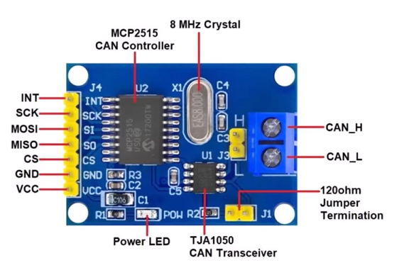
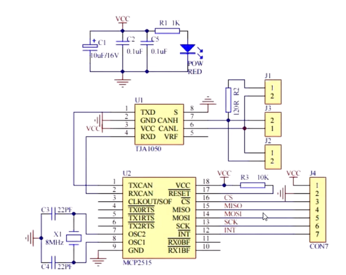
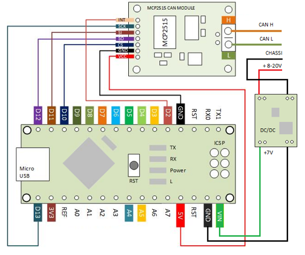

# MCP2515 Module

The CAN Bus Module implements the CAN specification version 2.0B and supports 
a communication speed of up to 1Mb/s.

The MCP2515 CAN to SPI bus has a DC 5V power supply module and an SPI interface.

## CAN Controller

The **MCP2515** is a popular **stand-alone CAN controller** developed by Microchip Technology. 
It interfaces with microcontrollers (MCUs) via the **Serial Peripheral Interface (SPI)**,
enabling devices that do not have an on-chip CAN to connect to a CAN bus. 

The MCP2515 is widely used in automotive and industrial applications, among others, 
to provide a simple and efficient means of embedding CAN connectivity in projects.



Key Features of the MCP2515:
* **CAN V2.0B Capability**: It supports the CAN specification version 2.0B, which means 
    it is capable of handling both standard (with an 11-bit identifier) and extended 
    (with a 29-bit identifier) data and remote frames.
* **Data Rates**: Capable of transmitting and receiving data at speeds up to 1 Mbps.

* **SPI Interface**: Uses the SPI protocol for communication with MCUs, making it 
    compatible with a wide range of microcontrollers.
* **Buffers**: Comes with three transmit buffers and two receive buffers, allowing 
    for efficient management of messages.
* **Filters and Masks**: Features two acceptance masks and six acceptance filters, 
    which can be used to filter out unwanted messages and reduce the processing load 
    on the microcontroller.
* **Operational Modes**: Includes several operation modes such as normal, sleep, 
    loopback, and listen-only, providing versatility in how it can be used in a 
    CAN network.
* **Interrupt Functionality**: Offers interrupt outputs for indicating the status 
    of the CAN controller, including message transmission, message reception, and errors.

To use the MCP2515, we typically need to connect it to a microcontroller via the 
**SPI interface**. We also need to connect it to a CAN transceiver, which converts 
the MCP2515's digital signals into the differential signals used on a CAN network. 

The microcontroller is responsible for configuring the MCP2515 through SPI commands, 
sending messages to be transmitted on the CAN network, and processing received 
messages.

## CAN Transceiver
The **TJA1050** is a high-speed CAN transceiver IC designed by NXP Semiconductors. 
It serves as an interface between a CAN protocol controller, like the MCP2515, and 
the physical two-wire CAN bus. 

The TJA1050 is designed to provide differential transmit and receive capability to 
the CAN controller and is compliant with the ISO 11898 standard, which defines the 
physical and electrical characteristics of the CAN bus.


## Module Circuit Diagram




## Arduino and MCP2515 Module

### Wiring



### Library 

Add the `lib/arduino-mcp2515.zip` file as a library to the Arduino IDE.

To interact with the MCP2515 CAN module, we can use the `MCP2515` class
which provides the following operations:

* MCP2515(const uint8_t _CS, const uint32_t _SPI_CLOCK = DEFAULT_SPI_CLOCK, SPIClass * _SPI = nullptr)

* ERROR reset(void)

* ERROR setBitrate(const CAN_SPEED canSpeed, const CAN_CLOCK canClock)

* ERROR setNormalMode()

* ERROR sendMessage(const struct can_frame *frame)

* ERROR readMessage(struct can_frame *frame)


Available baudrates for the CAN interface:
```C++
enum CAN_SPEED {
    CAN_5KBPS,
    CAN_10KBPS,
    CAN_20KBPS,
    CAN_31K25BPS,
    CAN_33KBPS,
    CAN_40KBPS,
    CAN_50KBPS,
    CAN_80KBPS,
    CAN_83K3BPS,
    CAN_95KBPS,
    CAN_100KBPS,
    CAN_125KBPS,
    CAN_200KBPS,
    CAN_250KBPS,
    CAN_500KBPS,
    CAN_1000KBPS
};
```

Available clock speeds:
```C++
enum CAN_CLOCK {
    MCP_20MHZ,
    MCP_16MHZ,
    MCP_8MHZ
};
```
Default value is MCP_16MHZ

The MCP2515 can typically operate with several different clock frequencies, with common
values being 4 MHz, **8 MHz**, 16 MHz, and 20 MHz. The choice of clock speed affects 
the configuration of the CAN bus baud rate. The baud rate is derived from the `CAN_CLOCK` speed through a series of prescalers, phase segment, and propagation segment adjustments, which are configured to ensure reliable communication that matches the speed of the 
rest of the CAN network.


CAN frame format:
```C++
struct can_frame {
    uint32_t can_id;  /* 32 bit CAN_ID + EFF/RTR/ERR flags */
    uint8_t  can_dlc;
    uint8_t  data[8];
};
```


## References

* [Arduino MCP2515 CAN interface library](https://github.com/autowp/arduino-mcp2515)

*Egon Teiniker, 2020-2024, GPL v3.0* 