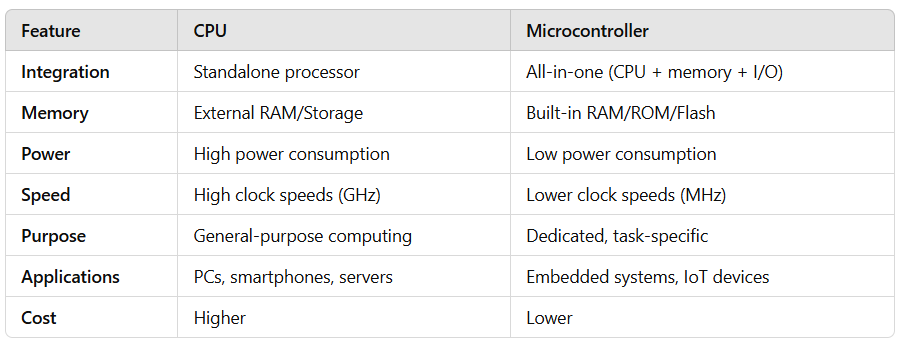

# Microcontroller Programming Basics

This section provides an introduction to **microcontroller programming**
using the **ATMega328P** microcontroller. The ATMega328P is a popular
microcontroller used in many embedded systems, including the **Arduino**.

## CPU vs. Microcontroller

A **CPU (Central Processing Unit)** and a **Microcontroller** are both essential 
computing devices but are designed for different purposes and contexts.

* **CPU**:
    * The CPU is the central component of a computer system, responsible for 
        **executing instructions**.
    * It is part of a larger system that includes other components like RAM, 
        storage, and input/output devices.

* **Microcontroller**:
    * A microcontroller is an **integrated system** that combines a **CPU**, 
        **memory (RAM and ROM)**, and **input/output peripherals** on 
        a single chip.
    * Designed for specific, dedicated tasks in **embedded systems**.

## Peripherals

Microcontrollers directly incorporates some **I/O hardware components**:

* [Memory (Flash, SRAM, EEPROM)](memory/)

* [I/O Ports](peripherals/io-ports/)

* [Interrupts and Timers](peripherals/interrupts/)

* [Serial Communication (UART)](peripherals/serial/)

* [I2C Bus](peripherals/i2c/)

* ...

## Hardware Abstraction

The use of **libraries and frameworks** enables an abstraction from the concrete 
microcontroller hardware - **Hardware Abstraction Layer (HAL)**. 

This makes it easy to get **applications running on different boards** 
implementing the same HAL.

[More...](hardware-abstraction/README.md)

## Programming Techniques

In addition to the use of hardware components, the following 
**programming techniques** are commonly used in the context of microcontroller 
programming:

* [Timing and Scheduling](programming-techniques/scheduling/)

* [State Machines](programming-techniques/state-machines/)

* [Object-Oriented Programming](programming-techniques/oop/)

## References

* Daniele Lacamera. **Embedded Systems Architecture**. Packt Publishing, 2023.

*Egon Teiniker, 2020-2024, GPL v3.0* 
