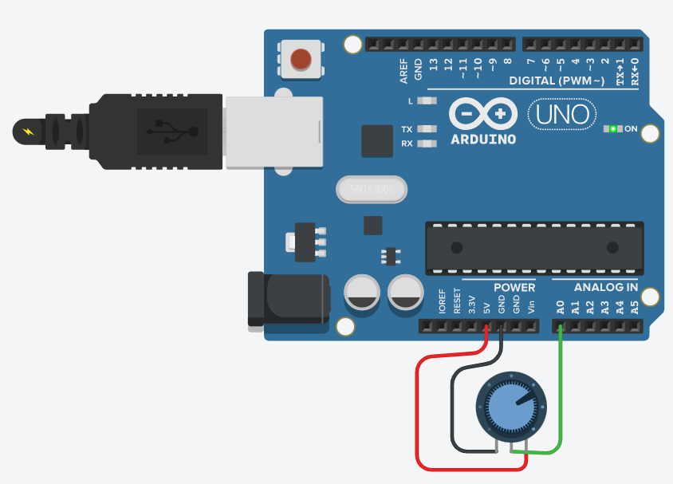

# EEPROM Data Memory

The ATmega328P contains 1 Kbyte of data EEPROM memory. 

It is organized as a separate data space, in which single bytes can be read and written. 
The EEPROM has an endurance of at least 100,000 write/erase cycles. 

_Example_: [Arduino EEPROM Calibration](https://www.tinkercad.com/things/hYf9OOX57nT)

In the given example, an analog value will be read from `A0` and the measured voltage
is extended by an amplification factor (`gain`) and an `offset`.

The values for `gain` and `offset` are first written into the EEPROM using the `put()`
operation.
Note that these values remain in the EEPROM even without a supply voltage.

```C
#include <EEPROM.h>

void setup() 
{
    Serial.begin(9600);    
  
    Serial.print("EEPROM size: ");
    Serial.println(EEPROM.length());
  
    EEPROM.put(0x00, 2.0);	// gain
    EEPROM.put(0x04, -5.0); 	// offset
}
```
In practice, the values would only be written to the EEPROM once (e.g. via the serial interface) 
and not with each `setup()`.

In the `loop()` function, we read the values for `gain` and `offset` from the EEPROM
using the `get()` operation.
```C
void loop() 
{
    float gain; 
    float offset; 
    EEPROM.get(0x00, gain);
    EEPROM.get(0x04, offset);
  
    uint16_t adc = analogRead(A0);
    float value = adc * 5.0/1023.0;
    value = value * gain + offset;	
    Serial.println(value);
    delay(100);                             
}
```

The EEPROM memory is very useful for storing calibration values or other configurations.


## Arduino Library Functions

The `EEPROM.h` header file declares the following operation which can be used to access the 
integrated EEPROM.

* **uint8_t read(int address)**\
Reads a byte from the EEPROM. Locations that have never been written to have the value of 255.

The parameter `address` specifies the location to read from, starting from 0.

Returns the value stored in the given location.

* **void write(int address, uint8_t value)**\
Write a byte to the EEPROM.
An EEPROM write takes 3.3 ms to complete. 
The EEPROM memory has a specified life of 100,000 write/erase cycles, so you may need to 
be careful about how often you write to it.

The parameter `address` specifies the location to read from, starting from 0. 
The second parameter is the `value` to write, from 0 to 255.


* **void update(int address, uint8_t value)**\
Write a byte to the EEPROM. **The value is written only if differs from the one already saved** at the same address.

The parameter `address` specifies the location to read from, starting from 0. 
The second parameter is the `value` to write, from 0 to 255.


* **uint16_t length(void)**\
This operation returns an unsigned int containing the number of cells in the EEPROM.

* **T &put(int address, const T &value)**\
Write any data type or object to the EEPROM.

The parameter `address` specifies the location to write to, starting from 0. 
The second parameter is the `value` to write, which can be a primitive type (e.g. float) 
or a custom struct.

The operation returns a reference to the data passed in.


* **T &get(int address, T &value)**\
Read any data type or object from the EEPROM.

The parameter `address` specifies the location to read from, starting from 0. 
The second parameter is the `value` to read, which can be a primitive type (e.g. float) 
or a custom struct.

The operation returns a reference to the data passed in.


## References

* [YouTube (DroneBot Workshop): Using EEPROM with Arduino - Internal & External](https://youtu.be/ShqvATqXA7g)

* [A guide to EEPROM](https://docs.arduino.cc/learn/programming/eeprom-guide)

* [EEPROM Library V2.0 for Arduino](https://github.com/arduino/ArduinoCore-avr/tree/master/libraries/EEPROM)

*Egon Teiniker, 2020-2023, GPL v3.0* 
