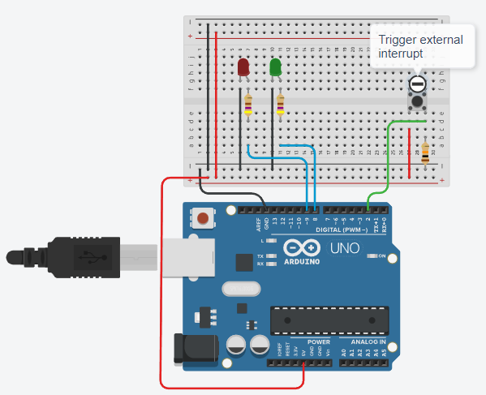

# External Interrupts 

External interrupts are limited in number on some AVR microcontrollers. 

The **ATmega328P** family has only two of them: 
* Arduino pin D2 is connected to the AVR controller's **INT0** interrupt 
* Arduino pin D3 is connected to the AVR controller's **INT1** interrupt 
These are high-priority interrupts, only REST is higher, and `INT0` takes 
priority if two arrive together.

_Example:_ External Interrupt 



In practice, switches bounce quite a lot, so we could use the 
**MC14490 Hex Contact Bounce Eliminator** chip to improve our circuit.

The following code lets the green LED blink (one second on, one second off).
If we push the button, immediately the red LED will switch its state. 
The button creates a RISING signal on the external interrupt pin, thus, the 
ISR `interrupt_service_button()` will be invoked.

```C
const int LED_GREEN_PIN = 8;
const int LED_RED_PIN = 9;
const int BUTTON_PIN = 2;

const unsigned long CYCLE_TIME = 1000;
unsigned long timestamp = 0;

bool led_green = false;
volatile bool led_red = false;

// Interrupt Service Routine
void interrupt_service_button()
{
  	digitalWrite(LED_RED_PIN, led_red);  
	led_red = !led_red;	
}

void setup()
{
    pinMode(LED_GREEN_PIN, OUTPUT);
    pinMode(LED_RED_PIN, OUTPUT);
    pinMode(BUTTON_PIN, INPUT);

    attachInterrupt(digitalPinToInterrupt(BUTTON_PIN), interrupt_service_button, RISING);
}

void loop()
{
  	// Cyclic Timing
    while(millis() < timestamp + CYCLE_TIME);  
    timestamp = millis();
  
  	// IO Handling
  	digitalWrite(LED_GREEN_PIN, led_green);  
  
  	// Processing
  	led_green = !led_green;
}
```


_Example:_ Tinkercad [Arduino: External Interrupt](https://www.tinkercad.com/things/3pUnUwfenLv)

The given simulation shows how a long running task (blinking the green LED) can be interrupted.


## Interrupt Library Operations

There are some functions in the Arduino framework which help in setting up and using these ISR 
(see `Arduino.h`):

* **#define interrupts() sei()**\
    Its purpose is to **enable global interrupts** which is done by calling the `sei()` function, which sets the interrupt flag in the status register to enable interrupts.

* **#define noInterrupts() cli()**\
    Its purpose is to **disable global interrupts** which it does by calling the `cli()` function, which clears the interrupt flag in the status register.

* **void attachInterrupt(uint8_t interruptNum, void (*userFunc)(void), int mode)**\
    This function is used to **attach an external interrupt** to a function within a sketch.
    The first parameter takes the interrupt number. 
    The second parameter is a pointer to the ISR function: void function(void)
    `mode` is the definition of the external stimulus which will cause the interrupt to fire:
	* **LOW**: Trigger the interrupt whenever the pin is low, 
        which will fire constantly for as long as the pin is held `LOW`. 	
	* **CHANGE**: Trigger the interrupt whenever the pin changes value from `HIGH` to `LOW` or from `LOW` to `HIGH`. 
	* **RISING**: Trigger the interrupt whenever the pin goes from `LOW` to `HIGH`. 
	* **FALLING**: Trigger the interrupt whenever the pin goes from `HIGH` to `LOW`. 

* **#define digitalPinToPort(P) ( pgm_read_byte( digital_pin_to_port_PGM + (P) ) )**\
    Returns a interrupt number when the pin passed to is either 2 for `D2` or 3 for `D3`.
    It is advisable to use this helper function because not all boards have the same pin connected to the same external interrupt.


* **void detachInterrupt(uint8_t interruptNum)**\
Turns off the given interrupt.
The parameter interruptNum is the number of the interrupt to disable (same as used for `attachInterrupt()`).


## References

* [YouTube (DroneBot Workshop): Understanding Arduino Interrupts](https://youtu.be/wIcC8-g9Lnw?si=O6zng19j7KYY7zFR)
* [YouTube (McWhorter): Tutorial for Programming Software Interrupts on Arduino](https://youtu.be/QhIm6e5AH44)

* [Arduino Interrupts Tutorial](https://circuitdigest.com/microcontroller-projects/arduino-interrupt-tutorial-with-examples)

* [Arduino: External interrupts](https://www.arduino.cc/reference/en/language/functions/external-interrupts/attachinterrupt/)

*Egon Teiniker, 2020-2024, GPL v3.0* 
