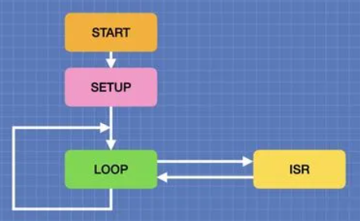

# Interrupts 

Interrupts are a method of **interrupting the execution of a program** in order to 
take care of something else. 

In its basic form, an interrupt works like this:
* A program is running.
* An interrupt occurs.
* The program is paused, and its data is put aside so that it can resume later.
* The code related to the interrupt is run - **Interrupt Service Routine (ISR)**
* When the ISR has finished, the program resumes where it left off.

_Figure: Interaction between the loop() function and the ISR at runtime (DroneBot Workshop)_ 

Interrupts are great for **monitoring events** such as switch presses or alarm 
triggers, which occur spasmodically. They are also the proper choice when you 
need to measure input pulses accurately.

Types of Interrupts:  
* **Hardware Interrupt**: It happens when an external event occurs like an external 
interrupt pin changes its state from LOW to HIGH or HIGH to LOW.
    * Example: [external-interrupt](external-interrupt/)    

* **Software Interrupt**: It happens according to the instruction from the software. 
For example Timer interrupts are software interrupt.
    * Example: [timer1-interrupt](timer1-interrupt/)

The Arduino framework allows to setup ISR functions which will be called automatically, 
whenever a certain type of event happens.

Each time the interrupt fires, the ISR function will be called.
The ISR function must not return any value, nor does it receive any parameters.
The processing it carries out should be kept **as short as possible**. 

If the ISR requires to access any **global variables**, then these variables must be defined as **volatile**.

## References

* [DroneBot Workshop: Using Arduino Interrupts – Hardware, Pin Change and Timer](https://dronebotworkshop.com/interrupts/)

*Egon Teiniker, 2020-2024, GPL v3.0* 
