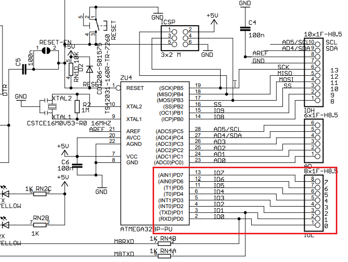
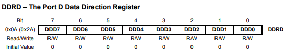
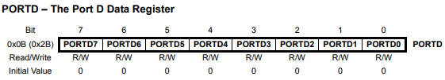
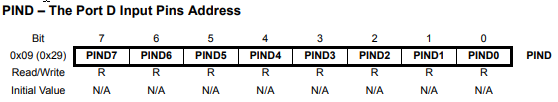

# Accessing I/O Ports via Registers

The ports of the Arduino Uno Board are connected directly to the pins of 
the ATmega328P. The microcontroller combines the pins into 8-bit ports.

_Example_: Port D of the ATmega328P corresponds to the digital IO ports 0 to 7 
    on the Arduino board.



Three **I/O memory address locations** are defined for each port:
* **DDRx**: Data direction register (read and write)
    * **DDxn = 1**: Pxn is configured as an **output pin**
    * **DDxn = 0**: Pxn is configured as an **input pin**.
* **PORTx**: Data register (read and write)
* **PINx**: Port input pins (read only)

If PORTxn is written logic 1 when the pin is configured as an input, 
the **pull-up resistor** is activated. 
To switch the pull-up resistor off, PORTxn has to be written logic 0
or the pin has to be configured as an output pin. 

64 **I/O registers** (0x0020 to 0x005F) are available in the **SRAM data memory**.
The following registers are responsible for the I/O port D:







The programmatic writing and reading of a port pin is therefore carried out by 
specifically setting and reading bits in these registers.

_Example_: Write digital pin 2 (Arduino Uno)

```C++
void setup() 
{
    // Set digital pin 2 as output
    DDRD |= (1 << DDD2);
}

void loop() 
{
    // Set digital pin 2 high
    PORTD |= (1 << PORTD2);
    delay(200);

    // Set digital pin 2 low
    PORTD &= ~(1 << PORTD2);
    delay(200);
}
```

In this example, we are directly manipulating the `DDRD` and `PORTD` registers to set `pin 2` 
as an output and set it high or low.

`DDRD` is the **Data Direction Register** for Port D, which controls whether the pins on `Port D` 
are inputs or outputs. To set `pin 2` as an output, we set the bit corresponding to `pin 2` in `DDRD = 1`.

`PORTD` is the Port D **Data Register**, which controls the output state of the pins on Port D. 
To set `pin 2` high, we set the bit corresponding to `pin 2` in `PORTD = 1`, and to set it low, 
we set the same bit to `0`.


_Example_: Read digital pin 4 (Arduino Uno)

```C++
void setup() 
{
    // Set digital pin 4 as input
    DDRD &= ~(1 << DDD4);
}

void loop() 
{
    // Read state of digital pin 4
    if (PIND & (1 << PIND4)) 
    {
        // Pin 4 is high
    } 
    else 
    {
        // Pin 4 is low
    }
}
```

In the `setup()` function, we are using `Port D` to access digital `pin 4`. 
To read the state of the pin, we first need to set it as an input by clearing the bit 
corresponding to `pin 4` in the `DDRD` register.

Next, in the `loop()` function, we read the state of the pin using the `PIND` register, 
which is the `Port D` Input Pins Address. 
We use a **bitwise AND operation** with a bitmask that has a `1` in the bit position 
corresponding to `pin 4` (`PIND4`). 
If the result is nonzero, the pin is high, and if it's zero, the pin is low.

_Example_: [Tinkercad - Native Digital IO](https://www.tinkercad.com/things/gW2rGRv73t4) 

## References
* [Arduino Core AVR: wiring_digital.c](https://github.com/arduino/ArduinoCore-avr/blob/master/cores/arduino/wiring_digital.c)
* [Arduino Core ESP32: esp32-hal-gpio.c]([arduino-esp32/cores/esp32/esp32-hal-gpio.c](https://github.com/espressif/arduino-esp32/blob/5f427c998a5eff55abf163a4fbeab17fff06e348/cores/esp32/esp32-hal-gpio.c))

* [ATmega328P Datasheet: 13. I/O Ports](https://ww1.microchip.com/downloads/en/DeviceDoc/Atmel-7810-Automotive-Microcontrollers-ATmega328P_Datasheet.pdf)

* Norman Dunbar. **Arduino Software Internals**. APress 2020
    * Chapter 3: Arduino Language Reference

*Egon Teiniker, 2020-2023, GPL v3.0*
