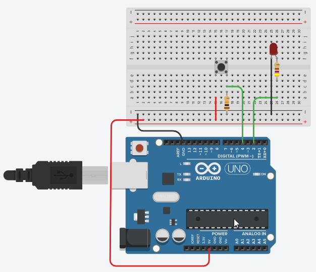

# Example: Native Digital I/O

In the following example, the status of a button is read via `pin 4` and 
output via the LED on `pin 2`.

_Example_: [Tinkercad: Native Digital IO](https://www.tinkercad.com/things/gW2rGRv73t4) 



```C++
void setup()
{
  	DDRD |= (1 << DDD2);   // pin 2 => output
  	DDRD &= ~(1 << DDD4);  // pin 4 => input
}

void loop()
{
    bool state = PIND & (1 << PIND4);
  
  	if(state)
  		PORTD |= (1 << PORTD2);  // pin 2 = 1
	else
        PORTD &= ~(1 << PORTD2); // pin 2 = 0
}
```

Note that in the given program the **I/O registers are accessed directly** instead 
of using the functions of the Arduino Framework.

## References

* [ATmega328P Datasheet](https://ww1.microchip.com/downloads/en/DeviceDoc/Atmel-7810-Automotive-Microcontrollers-ATmega328P_Datasheet.pdf)

*Egon Teiniker, 2020-2023, GPL v3.0*