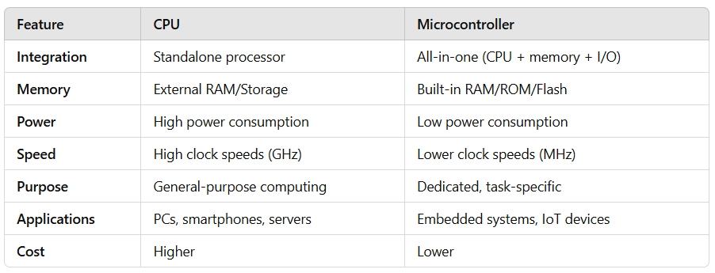

# Peripherals

The use of on-chip peripheral components is an essential part of 
microcontroller programming. we must refer to the datasheet of 
the respective microcontroller to get a description of the 
peripheral component registers.

_Example:_ Datasheet of the [ATmega328P](../../computer-architectures/microcontroller/atmega328p/datasheet-ATmega328P.pdf) microcontroller.

## CPU vs. Microcontroller

A **CPU (Central Processing Unit)** and a **Microcontroller** are both essential 
computing devices but are designed for different purposes and contexts.

* **CPU**:
    * The CPU is the central component of a computer system, responsible for 
        **executing instructions**.
    * It is part of a larger system that includes other components like RAM, 
        storage, and input/output devices.

* **Microcontroller**:
    * A microcontroller is an **integrated system** that combines a **CPU**, 
        **memory (RAM and ROM)**, and **input/output peripherals** on 
        a single chip.
    * Designed for specific, dedicated tasks in **embedded systems**.

## Peripheral Components

Microcontrollers directly incorporates some **I/O hardware components**:

* [Memory (Flash, SRAM, EEPROM)](peripherals/memory/)

* [I/O Ports](peripherals/io-ports/)

* [Interrupts and Timers](peripherals/interrupts/)

* [Serial Communication (UART)](peripherals/serial/)

* [I2C Bus](peripherals/i2c/)

* ...

## References

* Daniele Lacamera. **Embedded Systems Architecture**. Packt Publishing, 2023.

*Egon Teiniker, 2020-2024, GPL v3.0* 

