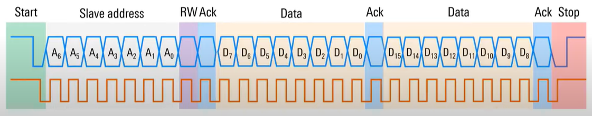
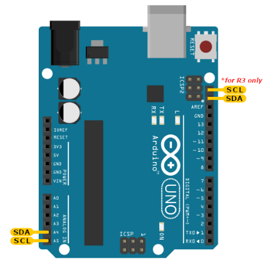

# I2C Communications

The **Inter-Integrated Circuit (I2C)** bus (a.k.a. 2-wire serial interface) 
is a widely used communication protocol in microcontroller-based systems 
for connecting low-speed peripheral devices to a microcontroller. 

It was originally developed by Philips Semiconductor and is well-suited 
for **communication between components on the same circuit board**.

* **Two-Wire Interface**:
    * **SCL (Serial Clock Line)**: Carries the clock signal, generated 
        by the master device, to synchronize data transfer.
    * **SDA (Serial Data Line)**: Carries the data being transmitted 
        between devices.

* **Master-Slave Architecture**:
    * The **master** initiates communication and controls the clock signal.
    * The **slave** responds to the master's requests. Multiple slave 
        devices can be connected to the same bus.

* **Addressing**: Each slave device on the I2C bus is assigned a 
        **unique 7-bit (or 10-bit) address**, enabling the master 
        to identify which slave to communicate with.

* **Bidirectional Communication**: The bus allows two-way communication, 
    enabling both reading from and writing to devices.

* **Pull-Up Resistors**: Both `SCL` and `SDA` lines are open-drain/open-collector, 
    requiring pull-up resistors to maintain a high state when no device 
    is pulling the line low.

* **Speeds**:
    * Standard Mode: Up to 100 kHz
    * Fast Mode: Up to 400 kHz
    * Fast Mode Plus: Up to 1 MHz
    * High-Speed Mode: Up to 3.4 MHz


## I2C Communication Process

The I2C communication process involves the exchange of data between devices 
connected to the I2C bus using a master-slave configuration. 



* **Start Condition**: The master generates a start condition by pulling 
    the **SDA line low** while the **SCL line is high**.

* **Address Frame**: The master sends the **slave address (7-bit or 10-bit)** 
    and a **read/write bit** to indicate the operation.
    * **R/W = 0**: Master wants to **write data to the slave**.
    * **R/W = 1**: Master wants to **read data from the slave**.

* **Acknowledgment (ACK)**: The addressed slave responds with an acknowledgment 
    which **pulls SDA low**.

* **Data Transfer**: Data is transmitted in 8-bit frames, followed by 
    an acknowledgment bit. 
    Multiple bytes can be transmitted in a single session.

* **Stop Condition**: The master generates a stop condition by releasing 
    the **SDA line to high** while **SCL is high.**

The I2C protocol’s simplicity and efficiency make it a go-to choice for 
short-distance communication between microcontrollers and peripheral devices.


## I2C on Arduino

The Arduino has dedicated pins for I2C, which have **built-in pull-up resistors** 
as required by the I2C protocol.



For Arduino Uno R3 boards, these are pins A4 and A5: 
* Pin **A4** is the **SDA** pin
* Pin **A5** is the **SCL** pin
* **VCC** and **GND** are also available for power supply.

In the Arduino Uno R3 version, there is another set of I2C pins near the USB socket.


## I2C Applications

* Communicating with sensors (e.g., temperature, humidity, accelerometers).

* Interfacing with real-time clocks (RTC).

* Connecting display devices like OLEDs and LCDs.

* Accessing EEPROMs for non-volatile data storage.

* Driving GPIO expanders, DACs, or ADCs.


## Examples

* [I2C Port Extension using the PCF8574](i2c-port-extension/)


## Wire Library
This library allows you to communicate with I2C devices. 

The Wire library implementation uses a 32 byte buffer, therefore any communication should be within this limit. Exceeding bytes in a single transmission will just be dropped.

To use this library, we include the `Wire.h` header file:
```C
#include <Wire.h>
```

The following methods are provided by the `Wire` class:

* **void Wire.begin()**\
    Initializes the `Wire` library and join the I2C bus as a **Master**. 
    This function should normally be called only once.


* **void Wire.begin(uint8_t address)**\
    If the Arduino join the bus as a **Slave**, a 7-bit address is specified.


* **void Wire.end()**\
    Disable the `Wire` library, reversing the effect of `Wire.begin()`.


* **uint8_t Wire.requestFrom(uint8_t address, uint8_t quantity)**\
    This function is used by the controller device (Master) to request bytes from a peripheral device (Slave).
    The 7-bit slave address of the device to request bytes from is the first parameter, 
    the number of bytes to request is the second one.

    It returns the number of bytes returned from the peripheral device.


* **void Wire.beginTransmission(uint8_t address)**\
    Begins a transmission to the I2C peripheral device (Slave) with the given address. 
    The parameter `address` is the 7-bit address of the device to transmit to.


* **uint8_t Wire.endTransmission(void)**\
    After `beginTransmission()`, the library queues bytes for transmission with the `write()` function and transmit them by calling `endTransmission()`.


* **size_t Wire.write(uint8_t value)**\
   **size_t write(const uint8_t *data, size_t len)**\
   **size_t Wire.write(String value)**\
    Writes data from a peripheral device (Slave) in response to a request from a controller device (Master), 
    or queues bytes for transmission from a controller (Master) to peripheral device (Master) - in-between calls to `beginTransmission()` and `endTransmission()`.

    Returns the number of bytes written.


* **int Wire.read(void)**\
    This function reads a byte that was transmitted from a peripheral 
    device to a controller device after a call to `requestFrom()` or 
    was transmitted from a controller device to a peripheral device. 
    `read()` inherits from the `Stream` utility class.

    Returns the next byte received.


* **int Wire.available(void)**\
    This function returns the number of bytes available for retrieval 
    with `read()`. This function should be called on a controller device 
    after a call to `requestFrom()` or on a peripheral inside the 
    `onReceive()` handler. 
    `available()` inherits from the `Stream` utility class.

    Returns the number of bytes available for reading.


* **void Wire.setClock(uint32_t)**\
    This function modifies the clock frequency for I2C communication. 
    I2C peripheral devices have no minimum working clock frequency, 
    however 100KHz is usually the baseline.

    `clockFrequency`: the value (in Hertz) of the desired communication 
    clock. Accepted values are `100000` (standard mode) and `400000` 
    (fast mode). Some processors also support `10000` (low speed mode), 
    `1000000` (fast mode plus) and `3400000` (high speed mode). Please 
    refer to the specific processor documentation to make sure the desired 
    mode is supported.


* **void Wire.onReceive(void(*)(int) handler)**\
    This function registers a function to be called when a peripheral 
    device receives a transmission from a controller device.

    `handler`: the function to be called when the peripheral device 
    receives data; this should take a single `int` parameter (the number 
    of bytes read from the controller device) and return nothing.


* **void Wire.onRequest(void(*)(void) handler)**\
    This function registers a function to be called when a controller 
    device requests data from a peripheral device.

    `handler`: the function to be called, takes no parameters and 
    returns nothing.


* **void Wire.setWireTimeout(uint32_t timeout = 25000, bool reset_with_timeout = false)**\
    Sets the timeout for Wire transmissions in master mode.

    `timeout`: timeout in microseconds, if zero then timeout checking is disabled.

    `reset_on_timeout`: if true then `Wire` hardware will be automatically reset 
    on timeout.


* **void Wire.clearWireTimeoutFlag(void)**\
    Clears the timeout flag.

    Timeouts might not be enabled by default. See the documentation for 
    `Wire.setWireTimeout()` for more information on how to configure 
    timeouts and how they work.


* **bool Wire.getWireTimeoutFlag(void)**\
    Checks whether a timeout has occurred since the last time the flag 
    was cleared.

    Returns the current value of the flag.

    This flag is set whenever a timeout occurs and cleared when 
    `Wire.clearWireTimeoutFlag()` is called, or when the timeout is 
    changed using `Wire.setWireTimeout()`.


## References

* [YouTube (Rohde Schwarz): Understanding I2C](https://youtu.be/CAvawEcxoPU?si=W6IZMsiB1BQTPFWw)

* [Expand Arduino’s IO | Interfacing PCF8574 with Arduino](https://www.electronicshub.org/interfacing-pcf8574-with-arduino/)

* [Arduino: Wire Library](https://www.arduino.cc/reference/en/language/functions/communication/wire/)

* [GitHub: Arduino Core - Wire](https://github.com/arduino/ArduinoCore-avr/tree/master/libraries/Wire)

*Egon Teiniker, 2020-2024, GPL v3.0* 
