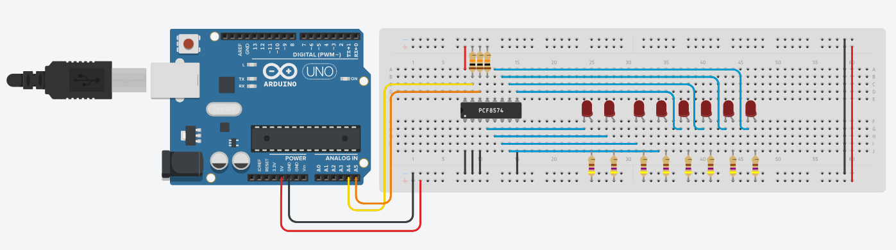
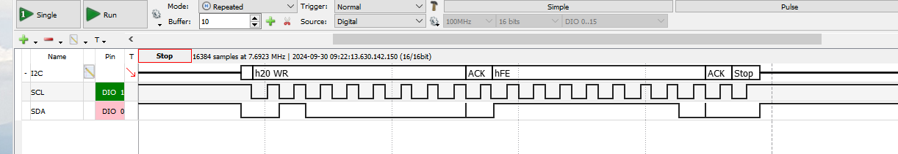
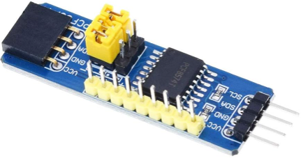
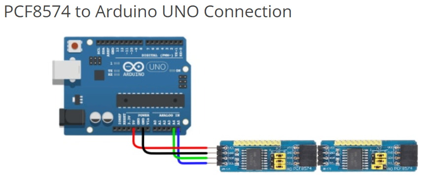
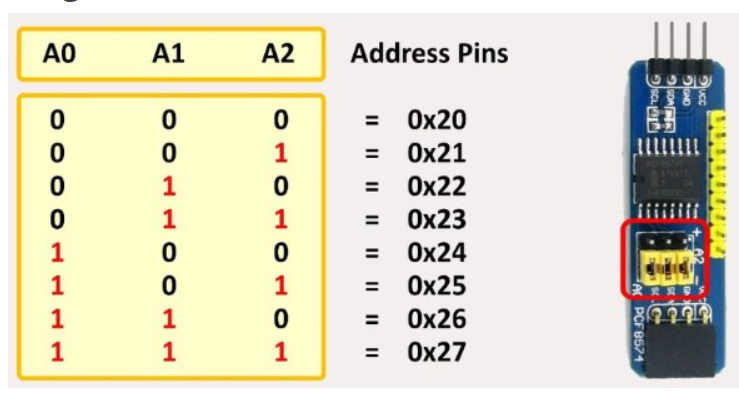

# I2C Port Extension using the PCF8574

By interfacing **PCF8574** with Arduino UNO, we can increase the number 
of IO pins of your Arduino so that we don’t have to worry about connecting 
several IO devices like LEDs, LCD Display, Motors, Sensors etc.

_Example:_ [TinkerCAD: I2C Port Extension (PCF8574)](https://www.tinkercad.com/things/fuRwUTuL8oF-arduino-i2c-port-extension-pcf8574)




This Arduino program demonstrates communication with an I2C device, 
such as a PCF8574 I/O expander, using the **Wire library**:

```C++
void setup() 
{
    Wire.begin(); // join i2c bus (address optional for master)
}
```

* **Wire.begin()**: Initializes the I2C interface in **master mode**, 
    allowing the Arduino to send data to or request data from an I2C 
    device.

* No specific I2C address is provided here, as this is only necessary 
    for slave devices - the Arduino acts as a master.


```C++
uint8_t invert(uint8_t data);

void loop() 
{
    uint8_t data = 0x01;

    for(uint8_t n = 0; n < 8; n++)
    {
        Wire.beginTransmission(0x20);     // PCF8574 IO (addresses from 0x20 to 0x27)
        Wire.write(invert(data << n));    // send one bytes
        Wire.endTransmission();           // stop transmitting
        delay(500);
    }
}
```

* The declared function `invert(uint8_t data)` that will invert the bits 
    of a byte. This is needed because the PCF8574 is an **active low** device.

* **Wire.beginTransmission(0x20)**: Starts I2C communication with the device 
    at address `0x20` (typically the address of the PCF8574).

* **Wire.write(invert(data << n))**: Writes the inverted value of data shifted 
    left by `n` bits. Each iteration shifts the `1` in data one position to 
    the left.

* **Wire.endTransmission()**: Completes the I2C communication with the device.


The following diagram shows the **I2C communication** between the Arduino 
and the PCF8574:



_Figure: Writing a byte to PCF8574_


## PCF8574 Module

This IO port extension based on PCF8574 is also available as an I2C module.



The I2C bus connection consists of the lines `Vcc`, `GND`, `SDA`, and `SCL`. 
In addition, the address of the respective module can be changed using three 
jumpers.
This means that several modules can be operated in parallel on the same I2C bus.

Several of this PCF8574 module can be **connected in series** (on the same I2C bus) 
if they have different addresses.



To change the address of a module, the jumpers must be set accordingly.




*Egon Teiniker, 2020-2024, GPL v3.0* 