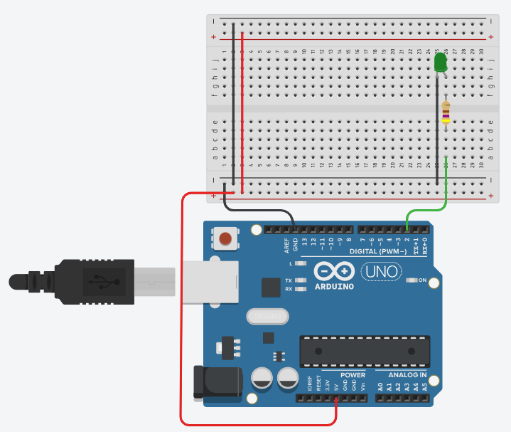

# Timer Interrupts 

Timer interrupts don’t use external signals. Instead, these interrupts are 
generated in software, and their timing is based upon the Arduino Uno’s 16 MHz clock oscillator.

The Arduino Uno has three internal timers:
* Timer0 (8bits)
* Timer1 (16bits) 
* Timer2 (8bits)

The number of bits determines the maximum number that the timer can count
to, 256 for the 8-bit timers and 65,536 for the 16-bit one.

## Timer 1

To create a delay of 1 second using Timer 1 and to toggle an LED 
connected to Pin 2 on an Arduino Uno, we will need to **set up Timer 1 
in a way that it triggers an interrupt every second**.

Upon each interrupt, we can then toggle the state of the LED.

_Example:_ [TinkerCAD: Timer 1 Interrupt - Toggle LED](https://www.tinkercad.com/things/61XNihYUyhI-timer1-interrupt)



```C++
void setup() 
{
  Serial.begin(115200);  
  pinMode(LED_PIN, OUTPUT);

  // Disable all interrupts
  noInterrupts();           

  // Clear registers
  TCCR1A = 0;
  TCCR1B = 0;

  // 15625 = 16MHz / (1024 * 1Hz) - 1 (must be less than 65536)
  OCR1A = 15624;            

  // Turn on CTC mode
  TCCR1B |= (1 << WGM12);   

  // Set CS10 and CS12 bits for 1024 prescaler
  TCCR1B |= (1 << CS12) | (1 << CS10);  

  // Enable timer compare interrupt
  TIMSK1 |= (1 << OCIE1A); 

  // Enable all interrupts
  interrupts(); 
}
```
Here's a breakdown of the `setup()` code:
* **Serial setup**: Set the baud rate used to communicate with the PC.
* Pin Setup**: The LED is connected to Pin 2 and is set as an output.
* **Timer 1 Setup**: Timer 1 is configured to operate in 
    CTC (Clear Timer on Compare Match) mode. 
    The pre-scaler is set to 1024, and the compare match register 
    (OCR1A) is set to 15624. This results in the timer reaching its 
    compare value every 1 second (given a 16MHz clock).
* **Interrupts**: The Timer 1 Compare A Match interrupt is enabled. 


The ISR (Interrupt Service Routine) for this interrupt, TIMER1_COMPA_vect, 
toggles the state of the LED.

```C++
ISR(TIMER1_COMPA_vect) 
{
  // 
  digitalWrite(LED_PIN, digitalRead(LED_PIN) ^ 1); // Toggle LED state
}
```

Note that the `loop()` funktion uses the blocking `delay()` function 
to generate long breaks between serial communication to the PC.
```C++
void loop() 
{
  Serial.print("ping...");
  delay(5000);
  Serial.println("pong");
}
```

In the provided Arduino example, several registers are used to configure 
and control Timer 1. Understanding these registers is crucial for working 
directly with microcontroller hardware (see ATmega328p datasheet). 

Here is an overview of the registers and their settings:
* **TCCR1A and TCCR1B (Timer/Counter Control Registers)**:
    * These registers are used to configure the mode of operation of Timer 1.
    * TCCR1A = 0; and TCCR1B = 0; are used to reset the control registers, 
        ensuring they start from a known state.
    * TCCR1B |= (1 << WGM12); This sets the Waveform Generation Mode (WGM). 
        Specifically, (1 << WGM12) sets the timer to CTC (Clear Timer on Compare) mode. 
        In CTC mode, the timer counter is cleared to zero when the timer count value 
        (TCNT1) matches the OCR1A register.

* **OCR1A (Output Compare Register 1 A)**:
    * This register is used in CTC mode to hold the compare value.
    * OCR1A = 15624; sets the value that the timer counter will compare against. 
        With the pre-scaler and clock speed of the Arduino Uno (16MHz), setting 
        this to 15624 will result in a 1-second interval.

* **TIMSK1 (Timer/Counter Interrupt Mask Register)**:
    * This register determines which Timer 1 interrupts are enabled.
    * TIMSK1 |= (1 << OCIE1A); enables the Timer 1 Output Compare A Match interrupt. 
        When the TCNT1 matches OCR1A, the corresponding interrupt (TIMER1_COMPA_vect) 
        is triggered.

* **TCNT1 (Timer/Counter Register)**:
    * This is the actual Timer/Counter register for Timer 1, although it's not 
        explicitly set in the code.
    * It increments (or decrements, depending on mode) at each timer clock tick. 
        When it reaches the value in OCR1A (in CTC mode), it triggers the interrupt 
        if it's enabled.

* **Pre-scaler Settings (in TCCR1B)**:
    * TCCR1B |= (1 << CS12) | (1 << CS10); sets the pre-scaler for Timer 1. 
        Here, (1 << CS12) and (1 << CS10) set the pre-scaler to 1024. 
        This means the timer's clock frequency is the system clock frequency 
        (16MHz) divided by 1024.


**Disabling interrupts during timer setup** - `noInterrupts()` and `interrupts()` - 
is a common practice in embedded systems programming, particularly when configuring 
hardware peripherals like timers. 

Here are the key reasons for this:
* **Atomicity of Configuration**: Setting up a timer often involves writing to 
    multiple registers. Disabling interrupts ensures that these register configurations 
    are performed atomically, meaning the entire setup process is completed without 
    interruption. 
    This is crucial for maintaining the consistency and correctness of the configuration. 
    If an interrupt were to occur in the middle of the setup, it could lead to partial or incorrect configuration.

* **Preventing Premature Interrupts**: If the timer's interrupt is enabled and the timer 
    starts counting during its setup, it might reach its compare value and trigger an 
    interrupt before the setup is fully complete. 
    This could lead to unexpected behavior, as the Interrupt Service Routine (ISR) might 
    rely on the timer being fully configured.

* **Ensuring Predictable Behavior**: Especially in real-time systems, where timing is 
    crucial, disabling interrupts during setup ensures that the system's behavior is 
    predictable and not influenced by sporadic interrupts that could alter the timing.

## References

* [Using Arduino Interrupts – Hardware, Pin Change and Timer](https://dronebotworkshop.com/interrupts/)

* [ATmega328p Datasheet](/hardware/microcontroller/atmega328p/)

*Egon Teiniker, 2020-2024, GPL v3.0* 
