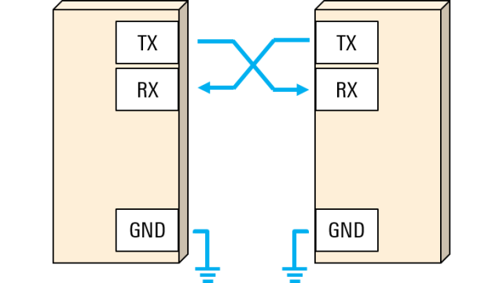
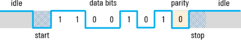
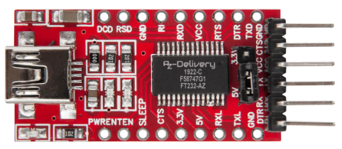

# Universal Asynchronous Receiver / Transmitter

The UART (Universal Asynchronous Receiver/Transmitter) interface is a type 
of serial communication protocol used in computers and electronic devices. 
It enables **asynchronous serial communication**, where data is transmitted 
and received sequentially one bit at a time. 

_Figure: Connecting two UART devices (Rohde-Schwarz)._

Here are the **key characteristics and components** of UART:
* **Asynchronous Communication**: Unlike synchronous communication, UART 
    does not use a separate clock signal to synchronize the sending and 
    receiving of data. Instead, both the transmitter and receiver must 
    agree on the data format and baud rate (speed of transmission) beforehand.

* **Baud Rate**: This is the speed of data transmission, measured in bits 
    per second (bps). **Both the transmitting and receiving devices must operate 
    at the same baud rate** for successful communication.

    The most **common baud rates** are `9600`, `38400`, `19200`, `57600`, 
    and `115200` bits/s.

* **Full-Duplex Communication**: UART can handle full-duplex communication, 
    meaning it can transmit and receive data simultaneously.

* **Use Cases**: UART is widely used for short-distance, low-speed, low-cost 
    data exchange between a microcontroller and peripherals such as sensors, 
    modems, and other microcontrollers.

* **Hardware Components**: A UART system typically includes a transmitter 
    (which converts parallel data from a data bus into serial form) and a 
    receiver (which converts the serial data back into parallel data for 
    the data bus). These are often integrated into a single chip.

## UART Frame 

A UART frame is the **basic unit of communication** in UART serial communication. 
It consists of a sequence of bits structured in a specific format. The frame is 
designed to ensure that the receiver can correctly interpret the data sent by 
the transmitter. 

_Figure: UART frames contain start and stop bits, data bits, and an optional parity bit (Rohde-Schwarz)._ 

* **Start and Stop Bits**:
    Because UART is asynchronous, the transmitter needs to signal that data bits are coming. 
    This is accomplished by using the start bit. The **start bit** is a transition from the 
    idle high state to a low state, and immediately followed by user data bits.

    After the data bits are finished, the **stop bit** indicates the end of user data. 
    The stop bit is either a transition back to the high or idle state or remaining at 
    the high state for an additional bit time. 
    
    A second (optional) stop bit can be configured, usually to give the receiver time to get 
    ready for the next frame, but this is uncommon in practice.

* **Data Bits**:
    The data bits are the user data or "useful" bits and come immediately after the start bit. 
    There can be 5 to 9 user data bits, although 7 or 8 bits is most common. 
    These data bits are usually transmitted with the **least significant bit first**.

* **Parity bit**:
    A UART frame can also contain an **optional parity bit** that can be 
    **used for error detection**. This bit is inserted between the end of 
    the data bits and the stop bit. 
    
    The value of the parity bit depends on the type of parity being used (even or odd):
    * In **even parity**, this bit is set such that the total number of 1s in the frame 
        will be even.
    * In **odd parity**, this bit is set such that the total number of 1s in the frame 
        will be odd.

_Example:_ **8N1** configuration: eight data bits, no parity, and one stop bit.

## RS232

RS-232 is a standard that **defines the electrical characteristics** and 
**connector types** for serial communication. 

While UART is a protocol for serial data communication, RS-232 is a standard that 
specifies how data should be physically transmitted and received through serial ports. 
Here are the key aspects of RS-232:

* **Electrical Specifications**: RS-232 defines the voltage levels that represent 
    logical states. 
    * A **logical '1'** (also referred to as a "mark") is represented by 
        a **negative voltage between -3V and -25V**.
    * A **logical '0'** (also known as a "space") is represented by a 
        **positive voltage between +3V and +25V**. 
    
    This is in contrast to the TTL (Transistor-Transistor Logic) levels used internally 
    by many UART devices, where '0' is 0V and '1' is usually +5V or +3.3V.

    Many UART interfaces include an **RS-232 level converter** (like a MAX232 chip) 
    to translate between the TTL levels used by the UART and the RS-232 voltage levels. 
    This allows devices with UART interfaces to communicate over RS-232 connections.

* **Connectors and Pinouts**: RS-232 commonly uses **DB9** or **DB25** connectors. 
    The standard defines the purpose of each pin on these connectors, such as transmitted 
    data, received data, data terminal ready, data set ready, and signal ground.

* **Distance and Speed Limitations**: RS-232 is suitable for relatively short distances. 
    Signal quality degrades over long distances or at higher baud rates. 
    Typically, **RS-232 is used for distances up to 15 meters**, although this can 
    vary based on the environment and the quality of the cable.

## RS485

RS-485 is a standard that defines the electrical characteristics for **multipoint 
serial data communication**. 
While UART is a protocol for serial data communication typically between two devices, 
RS-485 extends this capability to enable communication over a bus with multiple devices. 

Here are the key features of RS-485:

* **Differential Signaling**:
    RS-485 uses differential signaling for data transmission, where each data bit 
    is represented by a difference in voltage between two wires (A and B). 
    This method makes RS-485 more resistant to noise and allows for longer cable 
    lengths compared to single-ended methods like RS-232.

    To prevent signal reflections, RS-485 networks often require termination 
    resistors at the ends of the bus. These resistors match the characteristic impedance 
    of the cable.

* **Multi-Point Communication**: Unlike RS-232, which is designed for point-to-point 
    communication, RS-485 supports a bus topology where multiple devices can be connected 
    to the same pair of wires. This makes it suitable for networks of devices in industrial 
    and commercial applications.

* **Long Distance and High Speed**: RS-485 can transmit data over distances 
    up to  1200 meters, and at high speed, up to 10 Mbps, although speed and 
    distance are inversely related (higher speeds are achievable at shorter distances).

* **Addressing and Network Management**: Since multiple devices share the same bus, 
    RS-485 itself does not define a protocol for addressing individual devices. 
    **Higher-level protocols are used for device addressing and network management**.

RS-485 is widely used in **industrial control systems**, building automation, and 
networks where many devices need to communicate over long distances or in electrically 
noisy environments. It's known for its robustness and simplicity, making it a popular 
choice for many applications that require reliable serial communication.

## UART to USB Converter 

A UART to USB converter, often also referred to as a USB to UART converter, is a 
device that facilitates communication between a UART interface and a USB (Universal Serial Bus) interface. 

This type of converter is essential when you need **to connect a device with a UART interface 
(such as a microcontroller, sensor, or other serial device) to a computer** or another device 
that only has USB ports. 
The converter essentially bridges the gap between these two different communication standards.

Several integrated circuits (ICs) are popular for facilitating UART to USB conversion. 
Some of the well-known ones include the **FTDI FT232**, **Silicon Labs CP210x**, and 
**Prolific PL2303**. These chips handle the USB communication protocols and provide UART 
interfaces.

_Figure: FT232-AZ USB to TTL Serial Adapter using 3,3V and 5V_

Key Functions of a UART to USB Converter:

* **Signal Conversion**: It converts the UART's serial data signals, which are 
    typically transmitted in a non-differential, single-ended form, to the USB's 
    differential serial data format.

* **Voltage Level Shifting**: UART typically operates at TTL (Transistor-Transistor Logic) 
    voltage levels, where a logical '0' is close to 0V and a logical '1' is at a higher voltage (commonly 5V or 3.3V). 
    USB operates at different voltage levels, and the converter adjusts these levels accordingly.

* **USB Protocol Handling**: The converter includes a USB controller that manages the 
    USB-specific protocols, packet formatting, and timing, making the UART device compatible 
    with USB standards.

* **Virtual COM Port Creation**: On the computer side, the converter's driver software often 
    creates a virtual COM (Communication) port. This allows software applications to interact 
    with the UART device through standard serial communication APIs as if it were connected 
    to a physical serial port.

    The converter also allows for the configuration of serial communication parameters like 
    baud rate, parity, stop bits, and data bits to ensure compatibility with the UART 
    device's settings.

## References 
* [Arduino Learn: Universal Asynchronous Receiver-Transmitter (UART)](https://docs.arduino.cc/learn/communication/uart/)

* [Rohde-Schwarz: Understanding UART](https://www.rohde-schwarz.com/cz/products/test-and-measurement/essentials-test-equipment/digital-oscilloscopes/understanding-uart_254524.html)

* [YouTube: FTDI USB to Serial Adapter Demo](https://youtu.be/7yhgYJe2ShM?si=yrhTIoDcP7e0mZ92)

*Egon Teiniker, 2020-2023, GPL v3.0* 
