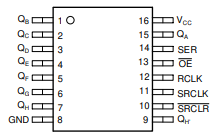
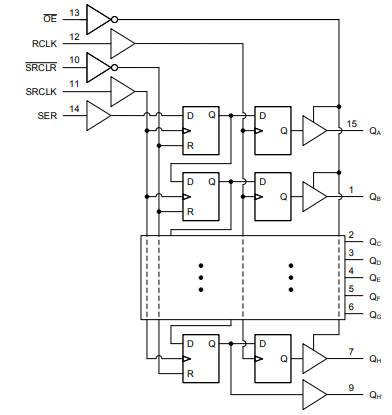

# Port Extension Using Shift Register

The 74HC595 is a widely used integrated circuit (IC) in digital electronics, particularly 
known for its role in **expanding the number of output pins available to a microcontroller**. 
It is part of the 74-series of logic ICs and uses High-Speed CMOS (Complementary 
Metal-Oxide-Semiconductor) technology. 

## 74HC595

Here's a detailed explanation of its features and functionality:

**Key Features**:
* **Type**: 8-bit Serial-In, Parallel-Out Shift Register.
* **Logic Family**: 74HC (High-Speed CMOS).
* **Voltage Range**: Typically operates at 2V to 6V.
* **Output Current**: Can drive up to 35 mA at its outputs.

**Pin Configuration**:

The 74HC595 typically comes in a 16-pin package with the following pin assignments:



* **Serial Data Input (SER)**: Receives the data to be shifted into the register.
* **Output Enable (OE)**: When low, enables the output; when high, the outputs are in a high-impedance state.
* **Shift Register Clear (SRCLR)**: Resets the shift register when low.
* **Shift Register Clock (SRCLK)**: Clock input for the shift register.
* **Latch Clock (RCLK)**: Clock input for the storage register (latch).
* **Output Data (QA-QH)**: Eight parallel outputs.
* **Serial Output (QA')**: Used for daisy-chaining multiple 74HC595s; outputs the serial data.
* **Ground (GND) and Vcc**: Power supply pins.

**How It Works**:



* **Shifting Data In**: Data is serially shifted into the IC through the DS pin 
    on each rising edge of the SHCP clock.
* **Storing Data**: After shifting the data into the shift register, a pulse on 
    the STCP (latch clock) transfers this data to the storage register.
* **Outputting Data**: The data in the storage register is then outputted in 
    parallel to the Q0-Q7 pins. The OE pin is used to enable or disable these outputs.
* **Cascading**: Multiple 74HC595s can be cascaded (daisy-chained) by connecting 
    the Q7’ output of one to the DS input of the next. This allows for extending 
    the number of outputs using additional ICs.

## Wiring Diagram 

In this example the 74HC595 is used to address 8 LEDs. Only 3 pins on the Arduino are needed.


## Source Code: Register Programming 

It starts with defining the required Arduino pins.

```C++
const int LATCH_PIN = 5;	// RCLK (Register Clock / Latch) Pin of the 74HC595
const int CLOCK_PIN = 6;	// SRCLK (Shit Register Clock) Pin of the 74HC595 
const int DATA_PIN = 4;		// SER (Serial input) Pin of the 74HC595 
```

The `shift_bit_in()` function sets the value data (`HIGH` or `LOW`) to the `DATA_PIN` 
of the shift register. A clock pulse is then generated (falling edge).

The `update_shift_register()` function gets a byte and shifts this byte bit by bit 
(LSB first) into the shift register.
The latch is disabled during the shift process.

```C++
void shift_bit_in(int data) 
{
    digitalWrite(DATA_PIN,data);
    digitalWrite(CLOCK_PIN,HIGH);
    digitalWrite(CLOCK_PIN,LOW);
}

void update_shift_register(uint8_t leds)
{
  	digitalWrite(LATCH_PIN, LOW);
  	for(uint8_t i; i<8; i++)
    {
      	shift_bit_in(leds & 1);
		leds >>= 1;
    }
   	digitalWrite(LATCH_PIN, HIGH);
}
```

At the beginning of the `loop()` function, the shift register is cleared.

The LEDs are then switched on one after the other in a loop. 
The `bitSet()` function sets the i-th bit in the variable `leds`. 
The `update_shift_register()` function writes the contents of the variable into the shift register.

```C++
void loop() 
{
    uint8_t leds = 0;	// LED states
    update_shift_register(leds);
    delay(500);
  
    for (int i = 0; i < 8; i++)	
    {
        bitSet(leds, i);		
        update_shift_register(leds);
        delay(500);
    }
}
```

As a result of this example, the 8 LEDs will be turned on in sequence and then turned off again.

_Example:_ [TinkerCAD: 74HC595 Port Extension](https://www.tinkercad.com/things/bJAyWSbxPoe-arduino-digital-port-extension-74hc595-register) 


## Source Code: Library Function

The Arduino Framework provides functions to work directly with shift registers.

_Example:_ [Tinkercad: 74HC595 Port Extension using `shiftOut()`](https://www.tinkercad.com/things/8iZWKXwZWYk-arduino-digital-port-extension-74hc595)


In this version, the `update_shift_register()` function sets the `LATCH_PIN` to `LOW` and 
then calls the Arduino `shiftOut()` function to shift the contents of the `leds` variable in 
the shift register before setting the `LATCH_PIN` back to `HIGH`.

```C++
void update_shift_register(uint8_t leds)
{
   digitalWrite(LATCH_PIN, LOW);
   shiftOut(DATA_PIN, CLOCK_PIN, LSBFIRST, leds);
   digitalWrite(LATCH_PIN, HIGH);
}
```

In the context of shift regsters, we can use the following **library functions** 
from the Arduino Framework:

* **void shiftOut(uint8_t dataPin, uint8_t clockPin, uint8_t bitOrder, uint8_t val)**\
    Shifts out a byte of data one bit at a time. Starts from either the most (i.e. the leftmost) 
    or least (rightmost) significant bit. Each bit is written in turn to a data pin, after which 
    a clock pin is pulsed (taken high, then low) to indicate that the bit is available.

    Note- if you’re interfacing with a device that’s clocked by rising edges, we need 
    to make sure that the clock pin is low before the call to `shiftOut()`, e.g. with a call 
    to `digitalWrite(clockPin, LOW)`.

    Parameters:
    * `dataPin`: the pin on which to output each bit. 
    * `clockPin`: the pin to toggle once the dataPin has been set to the correct value. 
    * `bitOrder`: which order to shift out the bits; either `MSBFIRST` or `LSBFIRST`    
        (Most Significant Bit First, or, Least Significant Bit First). 
    * `value`: the data byte to shift out. 

    Here is the implementation of this function
    (`ArduinoCore-avr/cores/arduino/wiring_shift.c`):
    
    ```C++
    void shiftOut(uint8_t dataPin, uint8_t clockPin, uint8_t bitOrder, uint8_t val) {
        uint8_t i;

        for (i = 0; i < 8; i++)  {
            if (bitOrder == LSBFIRST) {
                digitalWrite(dataPin, val & 1);
                val >>= 1;
            } else {	
                digitalWrite(dataPin, (val & 128) != 0);
                val <<= 1;
            }
                
            digitalWrite(clockPin, HIGH);
            digitalWrite(clockPin, LOW);		
        }
    }   
    ```

* **uint8_t shiftIn(uint8_t dataPin, uint8_t clockPin, uint8_t bitOrder)**\
    Shifts in a byte of data one bit at a time. Starts from either the most 
    (i.e. the leftmost) or least (rightmost) significant bit. For each bit, the 
    clock pin is pulled high, the next bit is read from the data line, and 
    then the clock pin is taken low.

    If you’re interfacing with a device that’s clocked by rising edges, you’ll 
    need to make sure that the clock pin is low before the first call to `shiftIn()`,
    e.g. with a call to `digitalWrite(clockPin, LOW)`.

    Parameters:
    * `dataPin`: the pin on which to input each bit. 
    * `clockPin`: the pin to toggle to signal a read from dataPin.
    * `bitOrder`: which order to shift in the bits; either MSBFIRST or LSBFIRST 
        (Most Significant Bit First, or, Least Significant Bit First).

    The function returns the value read from the shift register. 

   Here is the implementation of this function
    (`ArduinoCore-avr/cores/arduino/wiring_shift.c`):
    
    ```C++
    uint8_t shiftIn(uint8_t dataPin, uint8_t clockPin, uint8_t bitOrder) {
        uint8_t value = 0;
        uint8_t i;

        for (i = 0; i < 8; ++i) {
            digitalWrite(clockPin, HIGH);
            if (bitOrder == LSBFIRST)
                value |= digitalRead(dataPin) << i;
            else
                value |= digitalRead(dataPin) << (7 - i);
            digitalWrite(clockPin, LOW);
        }
        return value;
    }
    ```


## Source Code: Object-Oriented Programming 

The `PortExtension` class encapsulates all necessary data (pin assignments, 
data bytes) and provides methods for writing individual bits or bytes.

```C++
class PortExtension
{
	public:
  		PortExtension(int latch_pin, int clock_pin, int data_pin)
        {
          	_latch_pin = latch_pin;
          	_clock_pin = clock_pin;
          	_data_pin = data_pin;
          	_data = 0;

            pinMode(_latch_pin, OUTPUT);
  			pinMode(_data_pin, OUTPUT);  
  			pinMode(_clock_pin, OUTPUT);
          	_update_shift_register();
        }
  
  		void writeByte(uint8_t value)
        {
          	_data = value;
          	_update_shift_register();
        }
  
  		void setBit(uint8_t bit)
        {
          	bitSet(_data, bit);
          	_update_shift_register();
        }
  
  	private:
  		uint8_t _latch_pin;
  		uint8_t _clock_pin;
  		uint8_t _data_pin;
  		uint8_t _data;
  
 	 	void _update_shift_register(void)
		{
    		digitalWrite(LATCH_PIN, LOW);
    		shiftOut(DATA_PIN, CLOCK_PIN, LSBFIRST, _data);
    		digitalWrite(LATCH_PIN, HIGH);
		}
};
```

After instantiating the `PortExtension` class, you can work with the `port` 
object as if it were a component of the microcontroller.

```C++
PortExtension port(LATCH_PIN, CLOCK_PIN, DATA_PIN);

void loop() 
{
  	port.writeByte(0x00);
  	delay(500);
  
  	for (int i = 0; i < 8; i++)	
  	{
    	port.setBit(i);
    	delay(500);
  	}
}
```

_Example:_ [TinkerCAD: 74HC595 Port Extension OOP](https://www.tinkercad.com/things/a1W8GGV5kMr-arduino-digital-port-extension-74hc595-oop)


## References
* [DroneBot Workshop: 74HC595 & 74HC165 Shift Registers with Arduino](https://dronebotworkshop.com/shift-registers/)

* [YouTube (Paul McWhorter): Arduino Tutorial 42: Understanding How to Use a Serial to Parallel Shift Register (74HC595)](https://youtu.be/n3qmQHzcgto?si=nxvYTcWlgG3ooIsa)

* [Arduino Reference: shiftOut()](https://www.arduino.cc/reference/en/language/functions/advanced-io/shiftout/)
* [Arduino Reference: shiftIn()](https://www.arduino.cc/reference/en/language/functions/advanced-io/shiftin/)

Egon Teiniker, 2020-2024, GPL v3.0