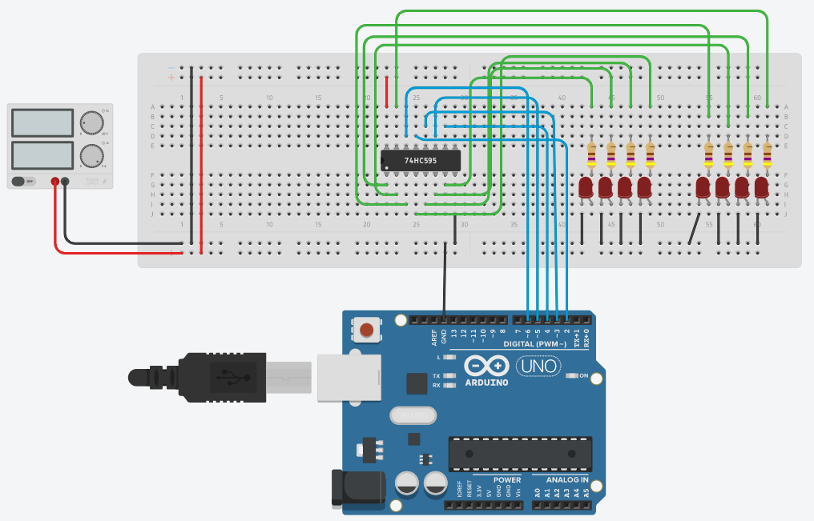

# Shift Register

The **74HC595** devices contain an **8-bit, serial-in,parallel-out** shift register that feeds an 8-bit D-type storage register. 

The **storage register** has parallel 3-state outputs. 

**Separate clocks** are provided for both the shift and storage register. 

The shift register has a direct **overriding clear (SRCLR) input**, **serial (SER)
input**, and **serial outputs for cascading**. When the **output-enable (OE)** input is high, 
the outputs are in the high-impedance state.

## Port Extensions

The 74HC595 is often used to implement **port extensions** for the Arduino.

_Example:_ [Shift Register 74HC595 (Tinkercad)](https://www.tinkercad.com/things/2iKCkXX1HWH)

## References

* [How to use a 74hc595 shift register](https://www.marginallyclever.com/2017/02/use-74hc595-shift-register/)
* [YouTube (DroneBot Workshop): 74HC595 & 74HC165 Shift Registers with Arduino](https://youtu.be/Ys2fu4NINrA)

*Egon Teiniker, 2020-2022, GPL v3.0* 
