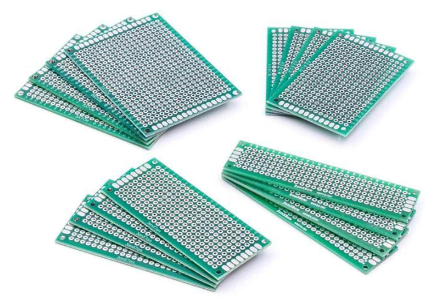

# Electronics Prototyping

Breadboards and perforated boards (also called perfboards) are essential tools 
for electronics prototyping, but they serve different purposes and are used at 
different stages of the design process.

## Breadboards

Breadboards are used for creating temporary and reusable electronic circuits 
**without soldering**.
Instead of soldering connections, they can simply be made with **jumper wires**.

* The **outermost tracks** (or busses) which are marked with `+` and `-` are 
    connected horizontally - indicated by the black and red wires.

* The **inner tracks** (or rows) are each connected vertically - shown by the green wires.

* On **TinkerCAD**, if we point to a lane with the mouse, the connection is briefly displayed.

Breadboards are ideal for **early-stage prototyping**, where the circuit design may undergo 
frequent changes. They are useful for **testing and debugging** basic circuits before committing 
to a permanent design.

## Perforated Boards (Perfboards)

Perfboards are used for creating permanent or **semi-permanent prototypes** that 
**require soldered** connections.

* They are composed of a rigid board with regularly spaced holes.

* The holes are often plated with copper pads on one side to facilitate soldering.

Perfboards are ideal for semi-permanent prototypes once the circuit design is stable.
They are also used in **low-volume production** or for hobby projects where PCBs 
are not necessary.

There are also perforated boards that have exactly the **same connections as the breadboards**. 
This makes transferring the circuit very easy.

## Breadboards vs Perfboards

We use a breadboard for quick prototyping, experimentation, and testing circuits 
without permanent modifications.
We transition to a perfboard when we need a more durable and permanent version of your 
circuit that closely resembles the final product.

## References

* [YouTube (Paul McWhorter): Arduino Tutorial 3: Understanding How Breadboards Work](https://youtu.be/CfdaJ4z4u4w)

*Egon Teiniker, 2020-2022, GPL v3.0* 
