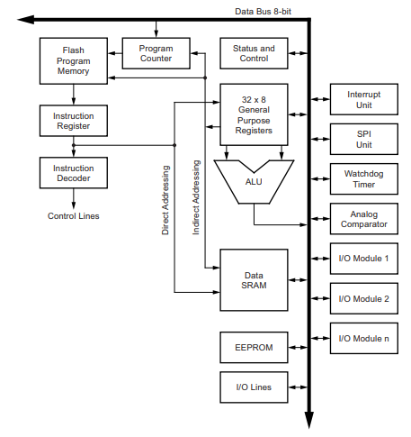

# ATMega328p

The ATmega328P is a widely used 8-bit AVR microcontroller developed by 
Microchip Technology (formerly Atmel).

* **Processor**: 8-bit AVR RISC architecture running at up to 20 MHz

* **Memory**: 32 KB Flash, 2 KB SRAM, 1 KB EEPROM

* **Operating Voltage**: 1.8V to 5.5V (typically run at 5V for 16 MHz 
    or 3.3V for 8 MHz)

* **Power Consumption**: Active mode: 0.2 mA at 1 MHz, 1.8V. 
    Power-down mode: 0.1 µA at 1.8V

## References

* [Getting Started with Arduino UNO R3](https://docs.arduino.cc/tutorials/uno-rev3/getting-started/)

*Egon Teiniker, 2020-2026, GPL v3.0* 
