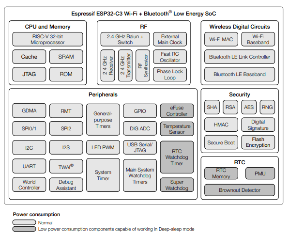

# ESP32-C3

ESP32-C3 is a low-power and highly-integrated MCU-based solution that 
supports 2.4 GHz Wi-Fi and Bluetooth® Low Energy (Bluetooth LE).

* **Processor**: **32-bit RISC-V** single-core CPU running up to **160 MHz**

* **Memory**: **400 KB SRAM**, 384 KB ROM, and typically **4 MB of embedded SPI flash**

* 2.4 GHz **Wi-Fi** (802.11 b/g/n, up to 150 Mbps) and **Bluetooth 5 (LE)** with long-range support

* **Security**: Supports Secure Boot, Flash Encryption, Digital Signature, and HMAC peripherals.

* Ultra-low **deep-sleep** current of approximately 5 µA

## References

* [Getting Started with Seeed Studio XIAO ESP32C3](https://wiki.seeedstudio.com/XIAO_ESP32C3_Getting_Started/)

*Egon Teiniker, 2020-2026, GPL v3.0* 