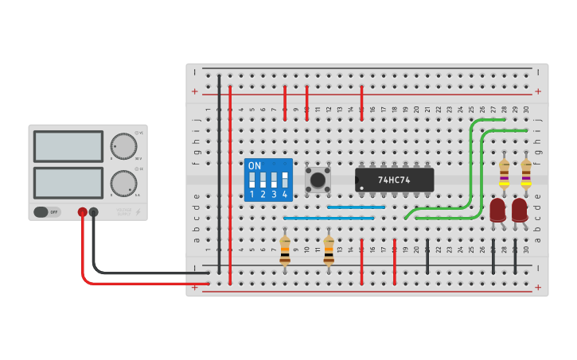

# D Flip-Flop

_Example:_ [D Flip-Flop: 74HC74 (Tinkercad)](https://www.tinkercad.com/things/3NlWHkeMYlp)

## References

* [Electronics Hub: Designing of D Flip Flop](https://www.electronicshub.org/d-flip-flop/)

*Egon Teiniker, 2020-2022, GPL v3.0* 
