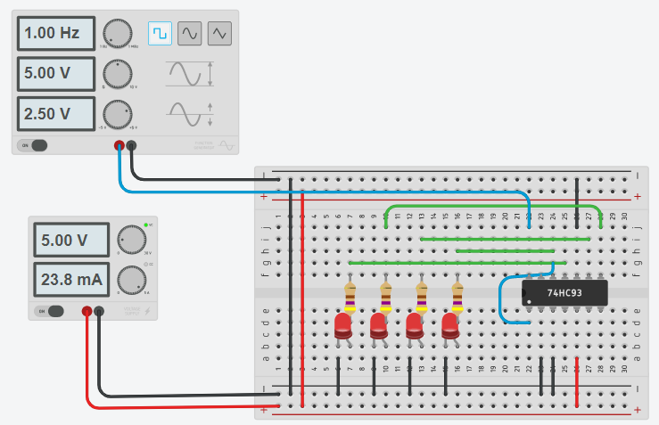

# Ripple Counter

In a ripple counter, the flip-flop output transition serves as a source for triggering other flip-flops. 

The C input of all flip-flops are triggered not by the common clock pulses
but rather by the transition that occurs in other flip-flop outputs

_Example_: [74HC93 4-Bit Binary Ripple Counter](https://www.tinkercad.com/things/aQe6ETv3oCR)

Instead of a **Function Generator**, we can use a simple [Schmitt-Trigger oscillator](../schmitt-trigger-oscillator/README.md).

## References

* [Ripple Counter](https://electronics-course.com/ripple-counter)

*Egon Teiniker, 2020-2022, GPL v3.0* 
