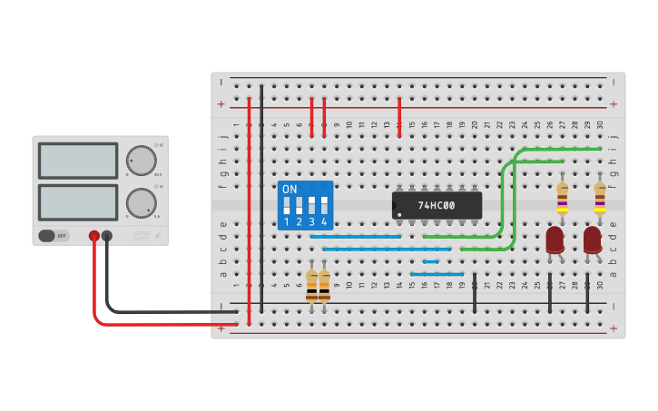

# RS Latch

_Example:_ [RS Latch using NAND Gates (Tinkercad)](https://www.tinkercad.com/things/jCPAfEFIv5M)

## References

* [Electronics Hub: SR Flip Flop-Designing using Gates and Applications](https://www.electronicshub.org/sr-flip-flop-design-with-nor-and-nand-logic-gates/)

*Egon Teiniker, 2020-2022, GPL v3.0* 
