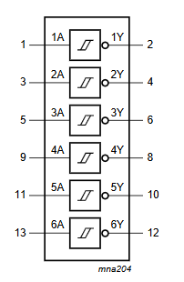
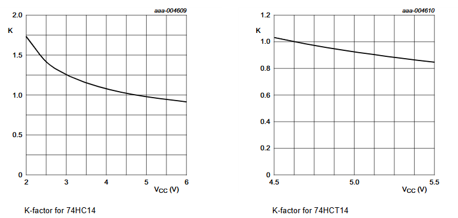
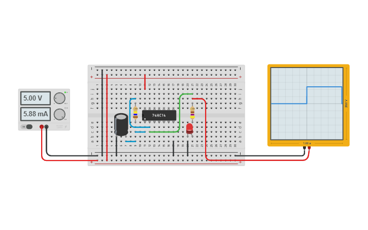

# Simulation: Schmitt-Trigger Oscillator

The **74HC14** provides six inverting buffers with Schmitt-trigger action. It is 
capable of **transforming slowly changing input signals into sharply defined, 
jitter-free output signals**.

Applications:
* Wave and pulse shapers
* **Astable multivibrators**
* Monostable multivibrators

## Astable Multivibrator

An astable multivibrator is an electronic circuit that continuously oscillates 
between two unstable states without any external triggering. It generates a stable, 
**repetitive square wave output**, making it ideal for applications like clock pulse 
generation, LED flashers, and tone generation. 

When implemented using the 74HC14 integrated circuit (IC), the astable multivibrator 
benefits from the hysteresis properties of Schmitt triggers to produce clean and 
stable oscillations.

An astable multivibrator built with the 74HC14 IC is a reliable and straightforward 
method to generate continuous square wave signals. By leveraging the hysteresis 
properties of Schmitt-trigger inverters, the circuit ensures stable and noise-immune 
oscillations. 

With adjustable resistor and capacitor values, the frequency of oscillation can be easily 
tailored to suit a wide range of applications in digital electronics and signal processing.

_Example:_ [TinkerCAD: 74HC14 Oscillator](https://www.tinkercad.com/things/2DMFrjuPJ2t)

## References
* [Exactly How Schmitt Trigger Oscillators Work](https://www.allaboutcircuits.com/technical-articles/exactly-how-schmitt-trigger-oscillators-work/)

*Egon Teiniker, 2020-2024, GPL v3.0* 
