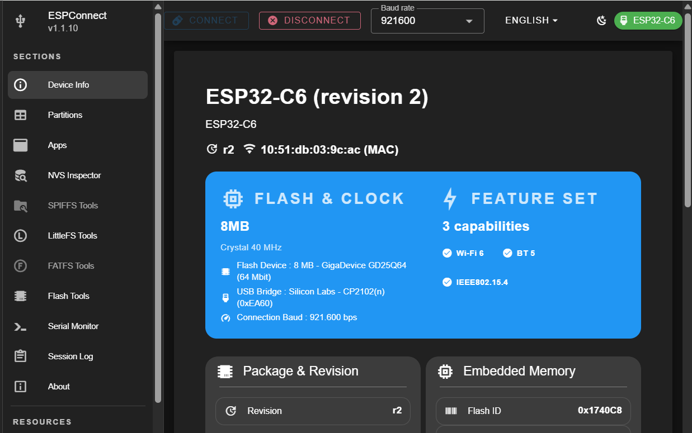

# ESP32 Connect

ESPConnect is a zero-install **control center for ESP32-class boards** 
that runs in a modern **Chromium-based browser**. Instead of installing 
a desktop flashing tool, we connect your board over USB and use 
the browser to **inspect device information**, **explore partitions**, 
**manage on-board file systems**, **flash firmware**, **view serial logs**, 
and **back up flash contents**. 

It uses browser serial/USB capabilities, and the project states that 
operations happen locally in the browser rather than via a backend service.

[Go to ESPConnect...](https://thelastoutpostworkshop.github.io/ESPConnect/)

The tool supports many ESP32 variants, including ESP32-S2, S3, C3, C6, 
H2, C5, P4, plus ESP8266, though the project notes that ESP8266 support 
is limited compared with ESP32.

## Inspect the Device
The Device Info view gives a live summary of the chip family, revision, 
MAC address, flash size, crystal frequency, and capabilities.

## Study the Partition Table
The Partitions view shows a graphical map and a detailed table of offsets, 
sizes, and unused regions.

This is one of the best teaching features because it turns an abstract 
embedded concept into something visual.

For example, we can directly see that ESP flash is not "one big memory blob". 
It is divided into regions such as:
* bootloader / metadata,
* application partitions,
* NVS,
* and file-system partitions.

That helps bridge theory and practice in topics like boot flow, OTA updates, 
and non-volatile data storage.

## Examine OTA Application Slots
The Apps tab lets you inspect application slots and identify 
which slot is active and what build metadata is present.

This is especially important to get a clean visual demonstration of:
* active vs staged firmware,
* dual-slot deployment,
* rollback and update reasoning.

ESPConnect helps make OTA architecture concrete.

## Inspect NVS Carefully
ESPConnect includes an experimental NVS Inspector for ESP32, which can 
detect NVS format versions, list namespaces and keys, decode common 
types, and visualize page state. But the project explicitly warns that 
it is read-only, experimental, and not authoritative for recovery or 
forensic use.

## Work With the File System
ESPConnect supports SPIFFS, LittleFS, and FATFS management. 
We can browse files, upload with drag-and-drop or file picker, back up the 
file system, restore images, preview text and images, and monitor storage 
usage.

This matters because many ESP32 projects separate:
* firmware in app partitions,
* configuration and assets in file-system partitions.

In an IoT product, HTML dashboards, JSON configs, certificates, 
audio prompts, or images may live there. ESPConnect lets us inspect 
that boundary directly.

## Flash Firmware and Make Backups
The tool can flash .bin files, use common offset presets, optionally erase 
flash, and capture backups of partitions or larger flash regions. It can 
also compute MD5 hashes for validation.

This is where ESPConnect becomes more than a viewer. It becomes a practical 
deployment and recovery tool.

## Use the Serial Monitor
The Serial Monitor streams UART output, allows sending commands, changing 
baud rate, and resetting the board from the browser. The Session Log keeps 
a history of connections, flashes, and warnings.

This supports debugging and also good lab documentation habits.

## References

* [YouTube: ESPConnect: The New All-In-One ESP32 Tool You’ll Wish You Had Sooner](https://youtu.be/-nhDKzBxHiI?si=PooTezqAceuhiBrA)

* [YouTube (DroneBot Workshop): ESP32 Online Tools - No IDE Required!](https://youtu.be/3aeRQVFXiF4?si=txCZqaa_ynYv4RFd)

*Egon Teiniker, 2020-2026, GPL v3.0* 
