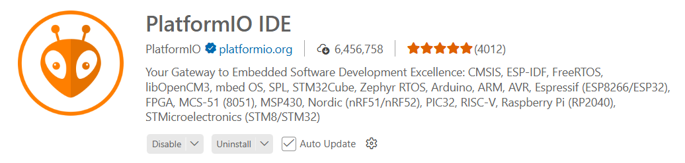

# Introduction to PlatformIO

PlatformIO is a comprehensive embedded systems development ecosystem designed 
to bring **modern software engineering practices** into microcontroller and IoT 
development. 

Instead of relying on minimal IDEs or single-file sketches, PlatformIO provides 
a structured, scalable workflow suitable for both hobby projects and professional 
firmware development.

* **Project-Based Builds**: 
    PlatformIO uses a project-oriented structure, similar to desktop or backend 
    software development.

    Instead of working with a single sketch file, we work inside a structured 
    project that:
    - Separates source files, headers, tests, and libraries
    - Stores build configuration in a central `platformio.ini`
    - Supports multiple build environments
    - Enables clean, reproducible builds

    This makes embedded projects easier to scale, maintain, and collaborate on.

* **Dependency Management**:
    PlatformIO includes a built-in library manager with version control support.
    - Declare dependencies in `platformio.ini`
    - Pin exact versions or use semantic version ranges
    - Automatically download and resolve library dependencies
    - Pull libraries from the PlatformIO Registry, Git repositories, or local paths
    
    This eliminates the common _it works on my machine_ problem caused by manual 
    library installation.

* **Multi-Target Builds**:
    One of PlatformIO’s most powerful features is the ability to build the same 
    codebase for multiple boards or configurations.
    - Compile for an Arduino Uno and an ESP32 from the same project
    - Maintain separate debug and release configurations
    - Switch between hardware revisions using environments
    - Test cross-platform compatibility easily
    
    This is handled through multiple environments defined in platformio.ini.

* **Unified Workflow Across Frameworks**:
    PlatformIO provides a consistent development workflow across different 
    embedded frameworks, including:
    - Arduino
    - ESP-IDF
    - STM32Cube
    - Zephyr
    - ...

    Regardless of the framework, you use the same commands and structure for:
    Building, Uploading, Monitoring, Debugging, Testing.

    This consistency dramatically reduces context switching when working across 
    platforms.

* **Integrated Tooling**:
    PlatformIO bundles the essential tools needed for embedded development:
    - Firmware upload tools
    - Serial monitor
    - On-chip debugging support (ST-Link, J-Link, CMSIS-DAP, etc.)
    - Unit testing framework integration
    - Static analysis and advanced build options
    - A CLI suitable for automation and CI pipelines

    Because everything is command-line accessible, it integrates smoothly into 
    CI/CD systems like GitHub Actions or GitLab CI.

we can use it in **VS Code via the PlatformIO extension** or the **CLI** 
(PlatformIO Core) with any editor.

## Setup 

In VS Code, install the PlatformIO IDE extension and restart.

## Tutorials

* [YouTube (DroneBot Workshop): Getting Started with PlatformIO](https://youtu.be/JmvMvIphMnY?si=_5UVqyZd4wtaxBpY)

* [YouTube: How to Program Arduino in VSCode Using Platform.io](https://youtu.be/dany7ae_0ks)

## References

* [PlatformIO](https://platformio.org/)

* [PlatformIO Documentation](https://docs.platformio.org/en/latest/)

_Egon Teiniker, 2020-2026, GPL v3.0_

