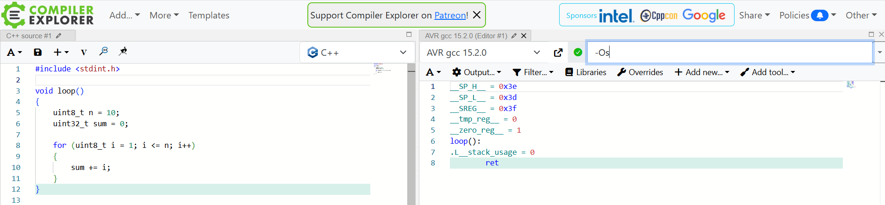

# Debugging and Compiler Optimizations

When debugging the following code, we will notice that the loop is not executed at runtime.

```C++
void loop() 
{
    uint8_t n = 10;
    uint32_t sum = 0;
    
    digitalWrite(LED_BUILTIN, HIGH);               
    for (uint8_t i = 1; i <= n; i++) 
    {
        sum += i;
    }
    digitalWrite(LED_BUILTIN, LOW);        
    delay(100);  
}
```

The compiler performs the calculation once during the compilation process 
and replaces the entire loop with a single constant value.
And because the result is not used further, the **code is completely eliminated**.

In technical terms:

* **Constant Folding**: The compiler evaluates expressions with constant 
    operands at compile time.

* **Dead Code Elimination**: Since the loop is no longer needed after the 
    result is "baked in," the compiler removes the loop instructions entirely.



To be able to debug such code, you have to **disable compiler optimization**:

```ini
; Disable optimization for debugging
build_unflags = -Os
debug_build_flags = -O0 -g3 -ggdb3
```

_Egon Teiniker, 2020-2026, GPL v3.0_