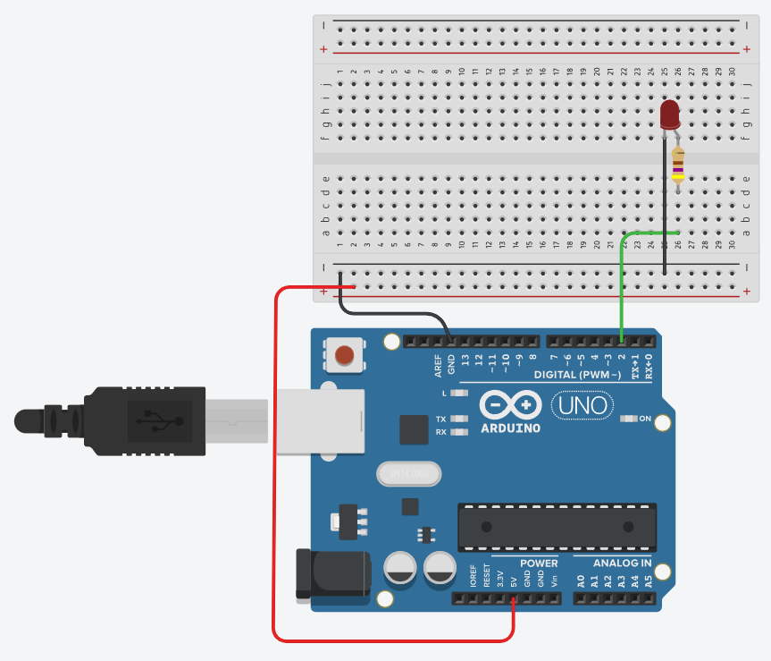

# Simulation: Arduino Blink




```C++
const int LED_PIN = 2;

void setup()
{
  pinMode(LED_PIN, OUTPUT);
}

void loop()
{
  digitalWrite(LED_PIN, HIGH);
  delay(1000); 
  digitalWrite(LED_PIN, LOW);
  delay(1000); 
}
```


## References

* [Tinkercad](https://https://www.tinkercad.com/things/bkjRath17ow)
 
* [YouTube: Blink an LED With Arduino in Tinkercad](https://youtu.be/yyG0koj9nNY)


*Egon Teiniker, 2020-2021, GPL v3.0* 
