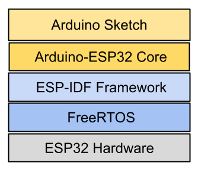

# FreeRTOS and the Arduino Framework on ESP32-C6

FreeRTOS is the OS kernel that **Espressif IoT Development Framework (ESP-IDF)** 
boots and runs everything on, and the **Arduino framework is layered on top 
of that**.

On the ESP32-C6, we find the following software layers:

* **Arduino Sketch**: Our application code using  `setup()` and `loop()`.

* **Arduino-ESP32 Core**: Provides Arduino APIs (`pinMode()`, `digitalWrite()`, 
    Serial, WiFi, etc.) but implemented using IDF facilities and running 
    inside IDF/FreeRTOS. 

* **ESP-IDF**: Drivers, Wi-Fi/BLE stacks, event loop, timers, NVS, etc.

* **FreeRTOS** (as an ESP-IDF component): Scheduler, tasks, queues, 
    semaphores, timers, ISR-to-task handoff, etc. 

* **ESP32-C6 Hardware +Bootloader**: RISC-V core, Interrupt controller,
     ROM startup code

Due to this software architecture, the following implications arise for 
the Arduino Framework:

* **The FreeRTOS scheduler is started by ESP-IDF, before your Arduino code**:
    In ESP-IDF, the runtime initializes hardware and FreeRTOS, then runs 
    the application entrypoint (`app_main`) inside a FreeRTOS task.

    That is why in Arduino-on-ESP32 you must not call `vTaskStartScheduler()` 
    yourself, FreeRTOS is already running when `setup()` begins.

* **setup() / loop() are executed by an Arduino-created FreeRTOS task**:
    Arduino-ESP32 creates a dedicated task (commonly referred to as loopTask) 
    and runs:
    - `setup()` once, then
    - `loop()` repeatedly

* **Arduino functions often map directly to FreeRTOS primitives**:
    A concrete example: `delay(ms)` in Arduino on ESP32 generally blocks 
    the current task rather than busy-waiting, by calling a FreeRTOS 
    delay (so other tasks keep running).

* **Our sketch coexists with many ESP-IDF system tasks**:
    Even if we only write a single-threaded Arduino sketch, the system 
    typically has other FreeRTOS tasks (networking, event loop, timers, 
    idle task, etc.). 
    
    ESP-IDF also adds supplemental facilities (like ring buffers and extra 
    hooks) that many components use.

* **Single-core scheduling still works the same way**:
    ESP32-C6 is a single-core RISC-V chip, so there’s no "pin to core 0/1" 
    in the way classic dual-core ESP32 does—but FreeRTOS still multiplexes 
    all tasks on that one core via preemption/time slicing and priorities. 

## YouTube Tutorials

### Simply Explained

* [What is FreeRTOS?](https://youtu.be/kP-pP6FEu8I)
    FreeRTOS can be used from within ESP IDF and Arduino.    

* [How to Multitask with FreeRTOS](https://youtu.be/WQGAs9MwXno)    
    * xTaskCreate()
    * vTaskDelay()

* [Manage FreeRTOS tasks - Suspend, Delay, Resume, Delete](https://youtu.be/jJaGRCgDo9s?si=1ZBI1Coe6A3cQmLx)
    * vTaskDelete()        
    * TaskHandle_t
    * vTaskSuspend()
    * vTaskSuspendAll()
    * vTaskResume()
    * xTaskResumeAll()

### Digi-Key Electronics

* [Part 1: What is a Real-Time Operating System (RTOS)?](https://youtu.be/F321087yYy4)
    * Task: Set of Program instructions loaded in memory.
    * Thread: Unit of CPU utilization with its own program counter and stack.
    * Process: Instance of a computer program.

* [Part 2: Getting Started with FreeRTOS](https://youtu.be/JIr7Xm_riRs)

* [Part 3: Task Scheduling](https://youtu.be/95yUbClyf3E?si=051YN9SgNIgvrAyq)

* [Part 4: Memory Management](https://youtu.be/Qske3yZRW5I?si=TJ-p58wu5jiKC7lX)

* [Part 5: Queue](https://youtu.be/pHJ3lxOoWeI?si=2015sxZI8Nzx6rIS)

* [Part 6: Mutex](https://youtu.be/I55auRpbiTs?si=57p6FpE6H6TNtaoJ)

* [Part 7: Semaphore](https://youtu.be/5JcMtbA9QEE?si=0YdQtZjEYHXZQkBS)

## References

* [Espressif IoT Development Framework - Get Started](https://docs.espressif.com/projects/esp-idf/en/stable/esp32/get-started/index.html)

* [FreeRTOS](https://www.freertos.org/)
* [GitHub: FreeRTOS](https://github.com/FreeRTOS)
* [DevCon23 - Using ESP-IDF FreeRTOS Functionality Within an ESP32 Arduino Project](https://youtu.be/fBWu8sCuat4?si=YRkz1xXItQ1KNBlT)

* [Arduino core for the ESP32](https://github.com/espressif/arduino-esp32)

*Egon Teiniker, 2020-2025, GPL v3.0* 