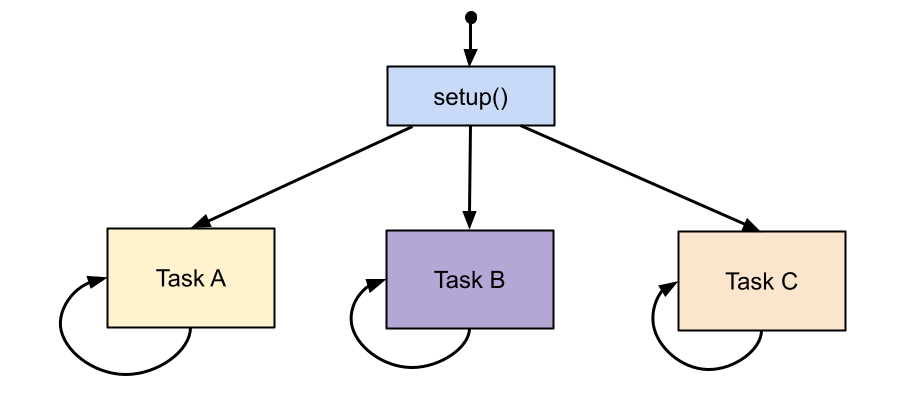
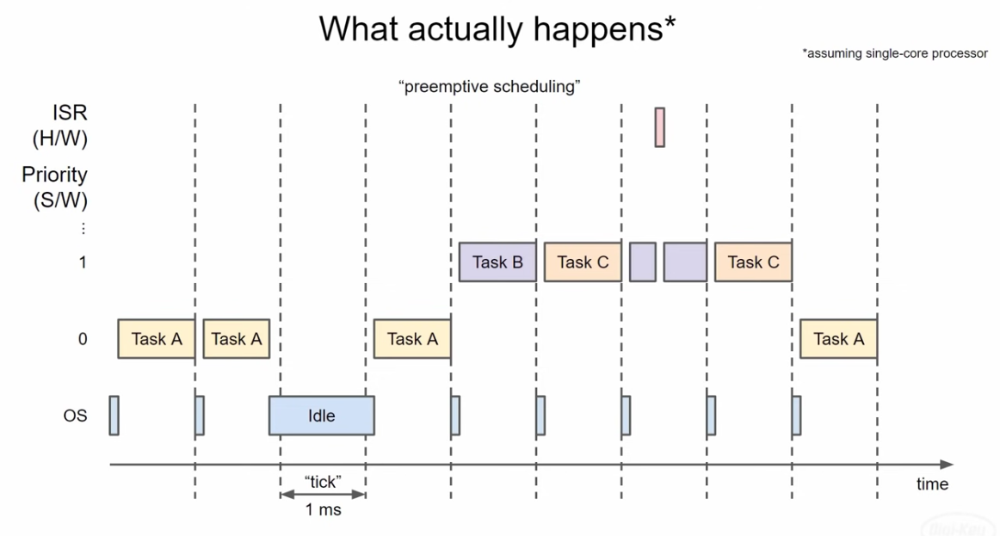

# FreeRTOS Tasks

A real time application that uses an RTOS can be structured as a **set of independent tasks**. 



_Figure: FreeRTOS tasks (Digi-Key Electronics)_

Each task **executes within its own context** with no coincidental dependency on other tasks 
within the system or the RTOS scheduler itself. 

Only one task within the application can be executing at any point in time and the real time 
**RTOS scheduler** is responsible for deciding which task this should be. 

Note that in FreeRTOS, a **task function must never return**.
If a task function terminates (returns), the behavior depends on how the task was created 
and the port configuration, but it is always a bug.

If a task function returns, FreeRTOS treats it as if:

```C++
vTaskDelete(NULL);
```
was called internally.



_Figure: FreeRTOS task Scheduling (Digi-Key Electronics)_

The RTOS scheduler may therefore repeatedly start and stop each task (swap each task in and 
out) as the application executes. As a task has no knowledge of the RTOS scheduler activity 
it is the responsibility of the real time RTOS scheduler to ensure that the processor context
(register values, stack contents, etc) when a task is swapped in is exactly that as when the 
same task was swapped out. 

To achieve this **each task is provided with its own stack**. 
When the task is swapped out the execution context is saved to the stack of that task so 
it can also be exactly restored when the same task is later swapped back in.


## Task States

A task can exist in one of the following states:


* **Running**: When a task is actually executing it is said to be in the Running state. 
    It is currently utilising the processor. If the processor on which the RTOS is 
    running only has a single core then there can only be one task in the Running 
    state at any given time.

* **Ready**: Ready tasks are those that are able to execute (they are not in the 
    Blocked or Suspended state) but are not currently executing because a different 
    task of equal or higher priority is already in the Running state.

* **Blocked**:
    A task is said to be in the Blocked state if it is currently waiting for either 
    a temporal or external event. For example, if a task calls vTaskDelay() it will 
    block (be placed into the Blocked state) until the delay period has expired - 
    a temporal event. Tasks can also block to wait for queue, semaphore, event group,
    notification or semaphore event. 
    
    Tasks in the Blocked state normally have a 'timeout' period, after which the task 
    will be timeout, and be unblocked, even if the event the task was waiting for has 
    not occurred.

    Tasks in the Blocked state do not use any processing time and cannot be selected 
    to enter the Running state.

* **Suspended**: Like tasks that are in the Blocked state, tasks in the Suspended 
    state cannot be selected to enter the Running state, but **tasks in the Suspended 
    state do not have a time out**. Instead, tasks only enter or exit the Suspended 
    state when explicitly commanded to do so through the vTaskSuspend() and xTaskResume() 
    API calls respectively.


## FreeRTOS API

### Tasks  

The following list includes the most important FreeRTOS functions for working with tasks:

* **xTaskCreate()**: Create a new FreeRTOS task (thread).

    ```C++
    BaseType_t xTaskCreate( TaskFunction_t pvTaskCode,
                            const char * const pcName,
                            const configSTACK_DEPTH_TYPE uxStackDepth,
                            void *pvParameters,
                            UBaseType_t uxPriority,
                            TaskHandle_t *pxCreatedTask
                        );
    ```

    - `pvTaskCode`: The name of the function (function pointer) that implements 
    the task. Tasks are normally implemented as an infinite loop. The function 
    which implements the task must never attempt to return or exit. 

    - `pcName`: A descriptive name for the task. 

    - `uxStackDepth`: The number of words (not bytes!) to allocate for use as 
        the task's stack. **Stack size in bytes on ESP32 Arduino**.

    - `pvParameters`: A value that is passed as the paramater to the created 
        task or `NULL` if there are no parameters. 

    - `uxPriority`: The priority at which the created task will execute. 
        Low priority numbers denote low priority tasks: higher number = 
        higher priority.

    - `pxCreatedTask`: Used to pass a handle to the created task out of the 
        `xTaskCreate()` function. `pxCreatedTask` is optional and can be set 
        to `NULL`.

    - If the task was created successfully then `pdPASS` is returned.
        Otherwise `errCOULD_NOT_ALLOCATE_REQUIRED_MEMORY` is returned.


### Timing

* **vTaskDelay()**: Delay a task for a given number of ticks. 
    This puts the current task into the Blocked state.

    ```C++
    void vTaskDelay( const TickType_t xTicksToDelay );
    ```
    
    - `xTicksToDelay`: The amount of time, in tick periods, that the calling 
        task should block. 

* **pdMS_TO_TICKS(xTimeInMs)**: A macro that converts milliseconds to 
        FreeRTOS ticks.

* **xTaskGetTickCount()**: Returns the current RTOS tick count since system start.
    Tick rate on ESP32 Arduino is typically 1000 Hz (1 ms per tick).

* **vTaskDelayUntil()**: Delay a task until a specified time. This function 
    can be used by periodic tasks to ensure a constant execution frequency.
    It provides a **precise periodic delay** with no accumulated drift.

    ```C++
    void vTaskDelayUntil( TickType_t *pxPreviousWakeTime,
                      const TickType_t xTimeIncrement );
    ```

    - `pxPreviousWakeTime`: Pointer to a variable that holds the time at which 
    the task was last unblocked. The variable must be initialised with the 
    current time prior to its first use.

    - `xTimeIncrement`: The cycle time period. The task will be unblocked at 
        time (*pxPreviousWakeTime + xTimeIncrement). Calling `vTaskDelayUntil`
        with the same `xTimeIncrement` parameter value will cause the task 
        to execute with a fixed interval period. 


## References

* [YouTube (Digi-Key Electronics): Part 3: Task Scheduling](https://youtu.be/95yUbClyf3E?si=051YN9SgNIgvrAyq)

* [YouTube (Digi-Key Electronics): Part 4: Memory Management](https://youtu.be/Qske3yZRW5I?si=TJ-p58wu5jiKC7lX)

* [YouTube (Simply Explained): How to Multitask with FreeRTOS](https://youtu.be/WQGAs9MwXno)    

* [YouTube (Simply Explained): Manage FreeRTOS tasks - Suspend, Delay, Resume, Delete](https://youtu.be/jJaGRCgDo9s?si=1ZBI1Coe6A3cQmLx)


* [Tasks and Co-routines](https://www.freertos.org/Documentation/02-Kernel/02-Kernel-features/01-Tasks-and-co-routines/00-Tasks-and-co-routines)

*Egon Teiniker, 2020-2025, GPL v3.0* 