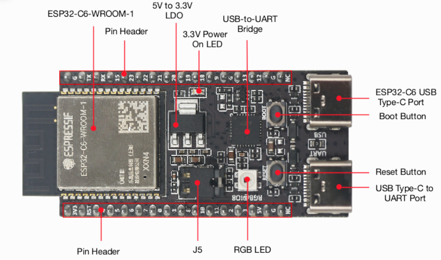

# ESP32-C6 

## Dev Board ESP32-C6-DevKitC-1

_Example:_ ESP32-C6-DevKitC-1-N8

* **Digital I/O**
    - Use **GPIO0, GPIO1, GPIO2, GPIO3, GPIO6, GPIO7, GPIO10, GPIO11, (GPIO18, GPIO19), GPIO20, (GPIO21, GPIO22), GPIO23**.
    - Treat **10–20 mA** per pin as a sane design target (LEDs, etc.).  
    - Inputs are high-Z; leakage is ±50 nA typ, and the internal pull-ups/downs are ~45 kΩ.

* **Analog IO** 
    - The C6’s ADC channels are only on **GPIO0, GPIO1, GPIO2, GPIO3, GPIO4, GPIO5, and GPIO6** (ADC1_CH0 to ADC1_CH6).

* **I²C**
    There are no fixed SDA/SCL pins—pick any two free GPIOs and set them in code. Two good choices:
    - High-power I²C (typical use): **SDA = GPIO21**, **SCL = GPIO22**.
    - Low-power I²C (deep-sleep LP-I²C peripheral): SDA = GPIO6, SCL = GPIO7.
    - Add **4.7 kΩ pull-ups** to 3V3 on SDA/SCL.

* **UART (Serial**)
    - UART0 on header: **TX = GPIO16, RX = GPIO17** (the board silkscreen “TX/RX”). Use this for an external sensor/console 
    if you’re not depending on that port for logs. 
    - You can create another UART on any free pins via the GPIO matrix, e.g. `HardwareSerial Serial1(1);`
    - ESP32-C6 has 2 UART controllers

* **CAN (TWAI)**
    ESP32-C6 includes two TWAI (Classical CAN) controllers. 
    - We can map TWAI_TX and TWAI_RX to (almost) any free GPIOs through the GPIO matrix: e.g. example **TX=GPIO19, RX=GPIO18**
    - We must add an external CAN transceiver (e.g., SN65HVD230/TJA1050).
    - C6 TWAI is not CAN-FD.

## References

* [ESP32-C6-DevKitC-1 v1.2](https://docs.espressif.com/projects/esp-dev-kits/en/latest/esp32c6/esp32-c6-devkitc-1/user_guide.html)
* [Why the ESP32 C6 DevKit is Perfect for RISC-V Learning](https://youtu.be/JPhw94YGt_o?si=34kFTfoHrNuiQAR9)

*Egon Teiniker, 2020-2025, GPL v3.0* 