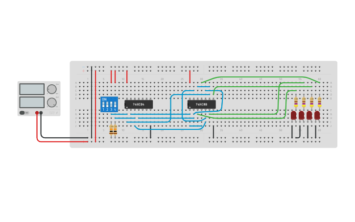
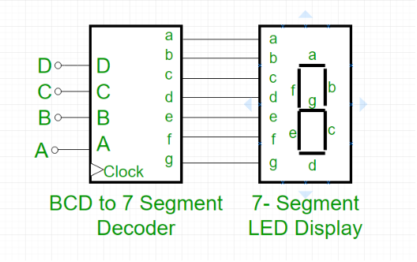

# Decoder

## 2-to-4 Decoder

_Example_: [2-to-4 Decoder (Tinkercad)](https://www.tinkercad.com/things/ga2CvBVTqgL)

## BCD to 7 Segment Decoder

**Binary Coded Decimal (BCD)** is the encoding scheme each of the decimal 
numbers(0-9) is represented by its equivalent binary pattern(which is 
generally of 4-bits).

**Seven Segment display** is an electronic device which consists of seven 
Light Emitting Diodes (LEDs) arranged in a some definite pattern (common 
cathode or common anode type), which is used to display Hexadecimal 
numerals(in this case decimal numbers, as input is BCD i.e., 0-9).

_Example:_ [BCD to 7 Segment Decoder](https://www.geeksforgeeks.org/bcd-to-7-segment-decoder/)

_Example:_ [CD74HC4511 BCD-to-7 Segment Latch/Decoder/Driver](https://www.ti.com/lit/ds/symlink/cd74hc4511.pdf?ts=1730176728255&ref_url=https%253A%252F%252Fwww.google.com%252F)

## References

* [Electronics Hub: Types of Binary Decoders,Applications](https://www.electronicshub.org/binary-decoder/)

*Egon Teiniker, 2020-2024, GPL v3.0* 
