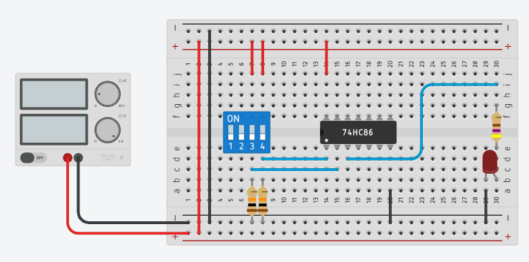

# XOR Gate

This circuit shows the use of an OR gate **75HC86**.

_Example:_ [XOR Gate: 74HC86 (Tinkercad)](https://www.tinkercad.com/things/9ErQfQGHa6p-xor-gate)

## References

*Egon Teiniker, 2020-2024, GPL v3.0* 
