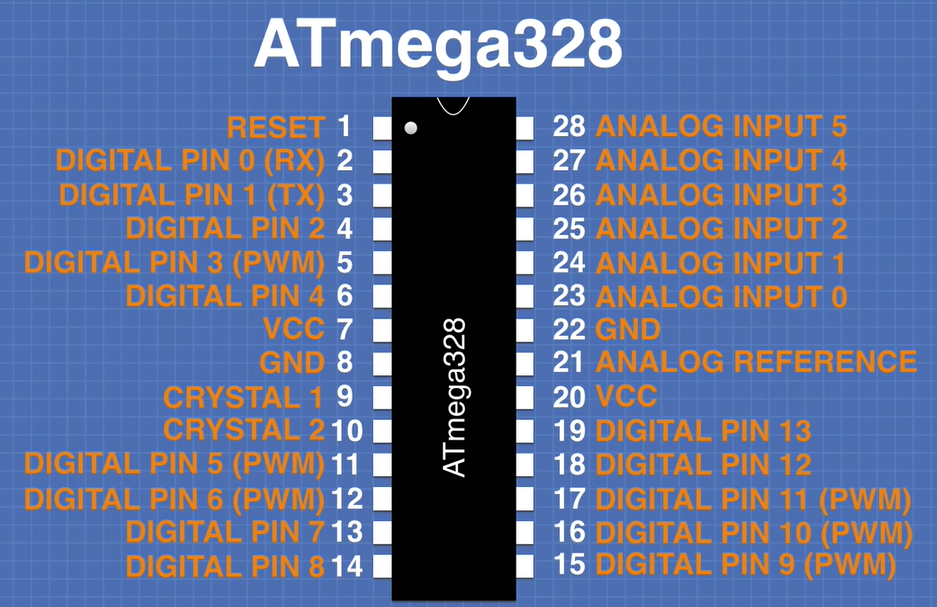
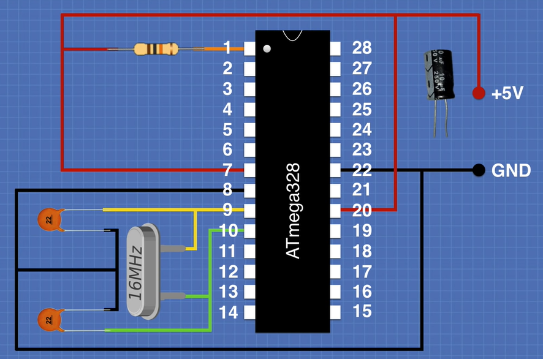

# Arduino ATmega328P on a Breadbord

When converting your design from an Arduino Uno to a raw ATmega328 chip it is helpful to be 
able to relate the pinouts on the ATmega328 to the connections on an Arduino Uno.  

The following pinout diagram has been relabeled to show the Arduino Uno equivalent functions:

The minimum circuit to get an ATmega328P running is shown in the next figure. 
The entire circuit can easily be built on a bread board.

## References

* [DroneBot Workshop: From Arduino Uno to ATmega328 – Shrinking your Arduino Projects](https://dronebotworkshop.com/arduino-uno-atmega328/)