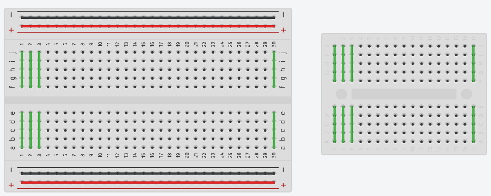

# Using a Breadboard

In electronics, breadboards are used to create quick **prototypes**.
Instead of soldering connections, they can simply be made with **jumper wires**.

Breadboards come in different sizes. It is important to remember how the individual tracks are connected internally - see illustration.

The larger breadboards have their own power supply tracks on the side.

## Using LEDs and Switchs

For practice, it is advisable to set up simple circuits on the breadboard without an Arduino.

In the example shown, 4 LEDs are controlled via 4 different DIP switches. 
Important in this circuit is the use of **series resistors (470 ohms) for the LEDs** and **pull-down resistors (10 KOhm) for the switches**.

This example can be simulated via [Tinkercad](https://www.tinkercad.com/things/edBOW4fxukG).

## References

* [YouTube (Paul McWhorter): Arduino Tutorial 3: Understanding How Breadboards Work](https://youtu.be/CfdaJ4z4u4w)

*Egon Teiniker, 2020-2022, GPL v3.0* 