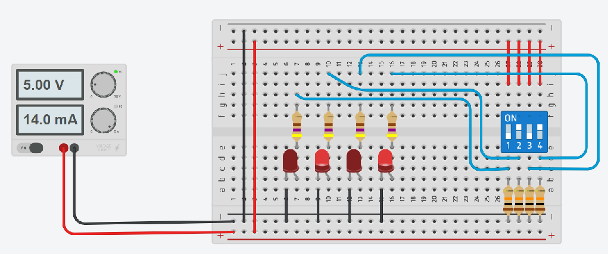

# Using Tinkercad

**Tinkercad Circuits** is an easy way to get started with learning electronics. 
Using the interactive circuit editor, we can explore, connect, and code virtual projects with a bottomless toolbox of simulated components.

After signing in to Tinkercad we will find a dashboard of our recent designs. 
By default, this dashboard will showcase designs made with Tinkercad’s 3D editor. 
To see a view of our Circuit designs, simply click the **Circuits** link in the left menu.

## LED and Pushbutton

For practice, it is advisable to set up simple circuits on the breadboard without an Arduino.

In this circuit, a pushbutton is used to turn an LED on and off.
Each **LED needs a series resistor (330 ohms) to limit the current**.
In order to give the button's output a defined logical level, it is pulled to GND with a **pull-down resistor (10K ohms)**. The push-down resistor is not necessary for the LED control, for Arduino inputs it is.

This example can be simulated via [Tinkercad](https://www.tinkercad.com/things/8kKVf82GV4V).

## LEDs and DIP Switchs

A DIP switch can be used if several logical states are to be set.

In the example shown, 4 LEDs are controlled via 4 different DIP switches. 
Important in this circuit is the use of **series resistors (470 ohms) for the LEDs** and **pull-down resistors (10 KOhm) for the switches**.

This example can be simulated via [Tinkercad](https://www.tinkercad.com/things/edBOW4fxukG).

## References

* [Tinkercad](https://www.tinkercad.com/)
* [Learn how to Tinker](https://www.tinkercad.com/learn/circuits/learning)
* [Official Guide to Tinkercad Circuits](https://blog.tinkercad.com/official-guide-to-tinkercad-circuits)
 
* [YouTube: Introduction to Tinkercad with a Series DC circuit](https://youtu.be/enoAt9dX4Dk)

*Egon Teiniker, 2020-2022, GPL v3.0* 
