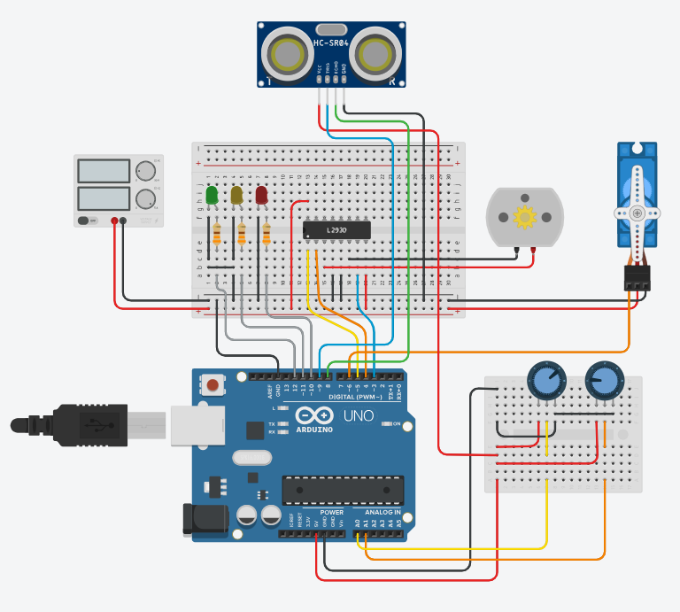

# Example: Car Control

This example shows the control of servo and DC motors as well as the evaluation 
of an ultrasonic distance sensor.

## Wiring Diagram 

## Simulation 

_Example:_ [TinkerCAD Car Control](https://www.tinkercad.com/things/4XOOH7icKOI-arduino-car-control)

