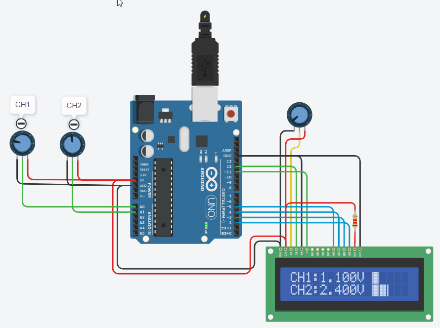

# Example: LCD Voltmeter

In this example, two voltage values are read via the ADC pins `A0` and `A1` and displayed on the LCD.
The display is in each case as a numerical value and as a bar.

## Wiring Diagram

## Simulation

_Example:_ [Tinkercad: LCD Voltmeter](https://www.tinkercad.com/things/fG4NdDwhTLJ)

## References

* [Arduino: LiquidCrystal](https://www.arduino.cc/reference/en/libraries/liquidcrystal/)

* [LiquidCrystal Library for Arduino](https://github.com/arduino-libraries/LiquidCrystal)

Egon Teiniker, 2020 - 2023, GPL v3.0