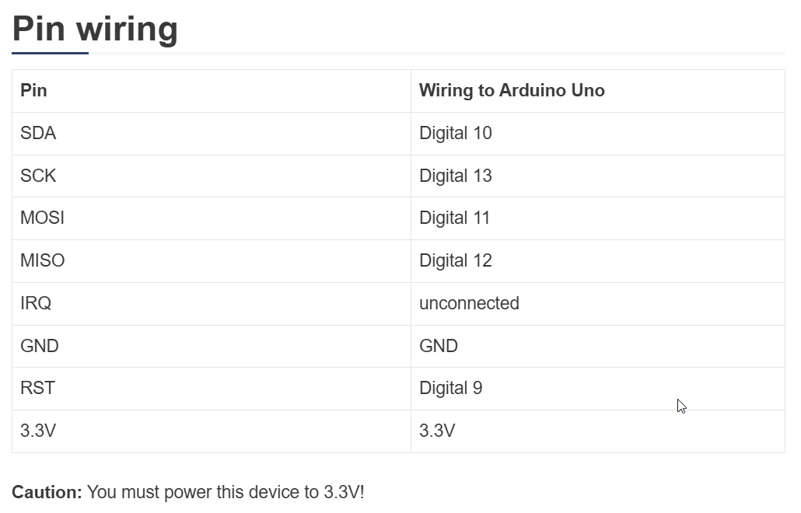

# MFRC522 RFID Reader

RFID means radio-frequency identification. RFID uses electromagnetic fields to transfer 
data over short distances.

An RFID system uses:

* **tags** attached to the object to be identified, in this example we have a keychain and an 
    electromagnetic card. Each tag has his own identification (UID).

* **the reader**, a two-way radio transmitter-receiver, that send a signal to the tag and 
    read its response.

Specifications of the MFRC522 RFID Reader:
* Input voltage: 3.3V
* Frequency: 13.56MHz

##  Wiring

## References

* [Security Access using MFRC522 RFID Reader with Arduino](https://randomnerdtutorials.com/security-access-using-mfrc522-rfid-reader-with-arduino/)

* [YouTube: Arduino RFID Module RC522 - How to Use](https://youtu.be/cFK87MJ96A8?si=-SC3Z-L_4ZCwsK_N)