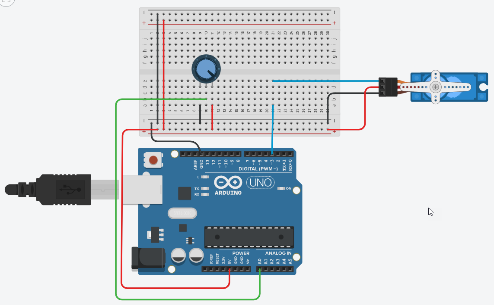

# Example: Servo Motor SG90 Controlled by a Potentiometer

## Wiring Diagram
The **servo motor** has three wires, of which the brown one is the ground wire and should be connected to the GND port of UNO, the red one is the power wire and should be connected to the 5V port, and the orange one is the signal wire and should be connected to the digital pin 3 (use a PWM pin).

The **potentiometer** is also connected to 5V and GND. The grinder is connected to the analog input A0 of the Arduino board.



## Source Code

To control the servo motor we will be using the `Servo.h` header file which comes pre-installed with the Arduino IDE.

The position of the potentiometer is read in as an analog voltage using the `analogRead()` function. The value range is between 0 and 1023 (10bit ADC). 

```C
#include <Servo.h>

const int SERVO_PWM_PIN = 3;
const int POTI_ANALOG_PIN = 0; 

Servo servo;

void setup(void)
{
    Serial.begin(9600);
    servo.attach(SERVO_PWM_PIN, 400, 2600);
} 

void loop(void)
{
    uint32_t poti = analogRead(POTI_ANALOG_PIN);
    uint8_t pos = map(poti, 0, 1023, 0, 180);
    Serial.println(pos);
    servo.write(pos);	  
}
```

To calculate the position of the servo motor, we need to convert the analog value (0 to 1023) to a value between 0 and 180.
```
    pos = poti / 1023 * 180
```

We can implement this conversion in the following ways:
* Using floating-point calculations
    ```C
    uint8_t pos = (uint8_t)poti/1023.0*180.0;
    ```

* Using integer calculations
    ```C
    uint8_t pos = poti*180/1023;    
    ```
    Note that the multiplication must be done first. The value range of `poti` must also be extended to `uint32_t` in order to display the intermediate results of the calculation correctly. The result then fits into an 8-bit integer variable.

* Using the build-in function `map()` from `Arduino.h`
    ```C
    uint8_t pos = map(poti, 0, 1023, 0, 180);
    ```

## Simulation

_Example:_ [Tinkercad: Servo Motor + Poti](https://www.tinkercad.com/things/aXIKGQHTkzV)


## Library Operations

The `Arduino.h` header file declares the following mapping-function:

* **long map(long value, long fromLow, long fromHigh, long toLow, long toHigh)**\
    Re-maps a number from one range to another. That is, a value of fromLow would get mapped to toLow, a value of fromHigh to toHigh, values in-between to values in-between.
    * `value`: the number to map.
    * `fromLow`: the lower bound of the value’s current range.
    * `fromHigh`: the upper bound of the value’s current range.
    * `toLow`: the lower bound of the value’s target range.
    * `toHigh`: the upper bound of the value’s target range.
    The function returns the mapped value.

    The `map()` function uses integer math. So fractions might get suppressed due to this. For example, fractions like `3/2`, `4/3`, `5/4` will all be returned as `1` from the `map()` function, despite their different actual values. So if your project requires precise calculations (e.g. voltage accurate to 3 decimal places), please consider avoiding `map()` and implementing the calculations manually in your code yourself.


## References
* [Arduino Reference: map()](https://www.arduino.cc/reference/en/language/functions/math/map/)


Egon Teiniker, 2020 - 2023, GPL v3.0