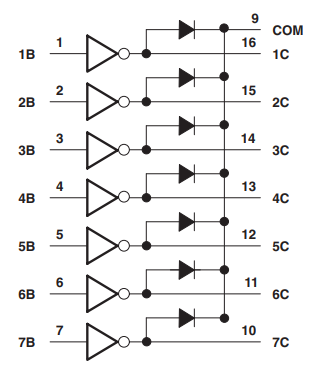

# Stepper Motor

**Stepper motors** are DC motors that rotate in precise increments or steps. 
Unlike DC motors stepper motors are controlled by applying pulses of DC electricity to their internal coils. Each pulse advances the motor by one step.

A **servo motor** is unique in that it’s motor shaft can be moved to a precise angle, most servos only **rotate 180 or 270 degrees**.
A servo motor is **aware of its position** and can be moved to a specific angle even if an external force moves the motor shaft.

**Steppers are unaware of their position**.  They can be moved to an exact position in reference to where they start stepping but unlike servos they can be misaligned if their shaft is moved by an external force.  
In many applications a servo is first moved to a **homing or reference position** before being controlled, printers commonly do this when they are first initialized.

Another advantage stepper motors have over DC motors is the ability to move at very slow speeds without stalling.
They also pack a lot of torque into a comparably small package.


## Wiring Diagram: 28BYJ-48 Stepper Motor

The **28BYJ-48** is a **5-wire unipolar stepper motor** that moves **32 steps per rotation internally** but has a **gearing system that moves the shaft by a factor of 64**. The result is a motor that spins at **2048 steps per rotation**.

The 28BYJ-48 stepper motor is commonly packaged with a tiny driver board based around the **ULN2003 Darlington transistor array**.  The board has a connector that mates perfectly with the motor wires so it is very easy to use. 



Each stage of the Darlington transistor array is constructed as follows: 


There are also connections for four 5-volt **digital inputs** as well as **power supply** (> 200 mA) connections.

**Always use a separate power supply to power your stepper motors!!!**


Note that we **connect the GND lines from Arduino board and the power supply**.


## Source Code

The **28BYJ-48 stepper motors** have internal gearing which reduces the output rotation by a factor of 64. So we define three constants to handle motor rotation:
* `STEPS_PER_REV` is the number of steps the actual motor takes per revolution. This is set at 32.
* `GEAR_RED` is the amount of gear reduction. I set mine to 64 but you may need to adjust this if your motor is different.
* `STEPS_PER_OUT_REV` is the final output of the motor shaft after gear reduction. It is the multiple of the above two numbers.

```C
#include <Stepper.h>

// Connection pins to ULN2003 Motor Driver
const int IN1 = 8;
const int IN2 = 9;
const int IN3 = 10;
const int IN4 = 11;

// Number of steps per internal motor revolution 
const int STEPS_PER_REV = 32; 
 
//  Amount of Gear Reduction
const int GEAR_RED = 64;
 
// Number of steps per geared output rotation
const int STEPS_PER_OUT_REV = STEPS_PER_REV * GEAR_RED;
  
// Note that the pins entered in sequence 1-3-2-4  
Stepper steppermotor(STEPS_PER_REV, IN1, IN3, IN2, IN4);
 
void setup()
{
    steppermotor.setSpeed(1000);   
}
 
void loop()
{
    steppermotor.step(STEPS_PER_OUT_REV); // rotate 360° CW
    delay(1000);
  
    steppermotor.step(-STEPS_PER_OUT_REV); // rotate 360° CCW
    delay(1000);
}
```

## Library Operations 

The build-in library behind `Stepper.h` is used to control the 28BYJ-48 stepper motor.
The stepper library takes care of sequencing the pulses we will be sending to our stepper motor and it can be used with a wide variety of motors, both **unipolar and bipolar**.

* **Stepper(int steps, int in1, int in3, int in2, int in4)**\
    The Constructor is used to initialize a new Stepper object, setting the 
    pins connected to the stepper motor module ULN2003 `In1`, `In2`, `In3`, `In4`.

    `steps` is the number of steps in one revolution of your motor. 
     
    `in1` to `in4` are the pins attached to the motor module.

* **void setSpeed(long rpms)**\
    This function sets the motor speed in rotations per minute (RPMs). This function doesn’t make the motor turn, just sets the speed at which it will when you call `step()`.

* **void step(int number_of_steps)**\
    This function turns the motor a specific number of steps, at a speed determined by the most recent call to `setSpeed()`. This function is **blocking** - it will wait until the motor has finished moving to pass control to the next line in your sketch. 

## References

* [YouTube (DroneBot Workshop): Stepper Motors with Arduino - Controlling Bipolar & Unipolar stepper motors](https://youtu.be/0qwrnUeSpYQ)
* [DroneBot Workshop: Stepper Motors with Arduino – Getting Started with Stepper Motors](https://dronebotworkshop.com/stepper-motors-with-arduino/)

* [GitHub: arduino-libraries/Stepper](https://github.com/arduino-libraries/Stepper)


*Egon Teiniker, 2020 - 2023, GPL v3.0*
