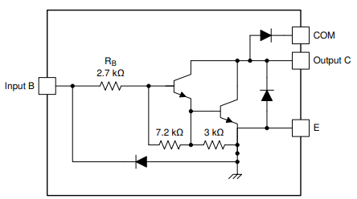
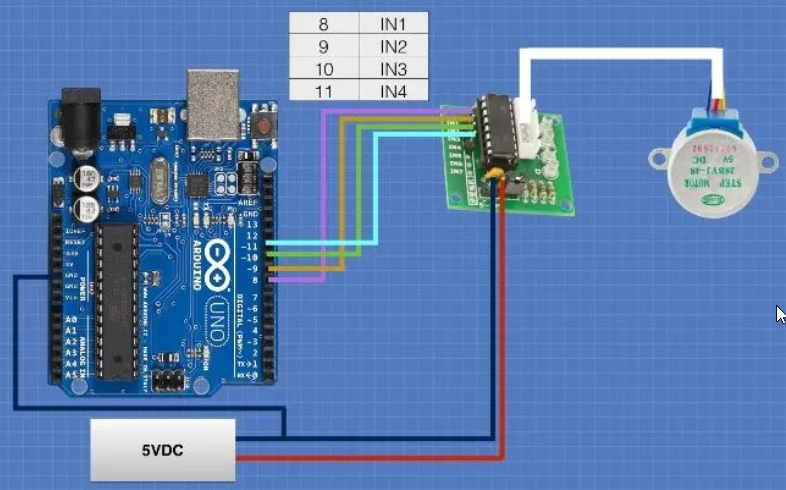

# Stepper Motor 28BYJ-48

The **28BYJ-48** is a **5-wire unipolar stepper motor** that moves **32 steps per rotation internally** but has a **gearing system that moves the shaft by a factor of 64**. The result is a motor that spins at **2048 steps per rotation**.

## Wiring Diagram

The 28BYJ-48 stepper motor is commonly packaged with a tiny driver board based around the **ULN2003 Darlington transistor array**.  The board has a connector that mates perfectly with the motor wires so it is very easy to use. 


Each stage of the Darlington transistor array is constructed as follows: 



There are also connections for four 5-volt **digital inputs** as well as **power supply** (> 200 mA) connections.

**Always use a separate power supply to power your stepper motors!!!**



Note that we **connect the GND lines from Arduino board and the power supply**.


## Source Code

The **28BYJ-48 stepper motors** have internal gearing which reduces the output rotation by a factor of 64. So we define three constants to handle motor rotation:
* `STEPS_PER_REV` is the number of steps the actual motor takes per revolution. This is set at 32.
* `GEAR_RED` is the amount of gear reduction. I set mine to 64 but you may need to adjust this if your motor is different.
* `STEPS_PER_OUT_REV` is the final output of the motor shaft after gear reduction. It is the multiple of the above two numbers.

```C
#include <Stepper.h>

// Connection pins to ULN2003 Motor Driver
const int IN1 = 8;
const int IN2 = 9;
const int IN3 = 10;
const int IN4 = 11;

// Number of steps per internal motor revolution 
const int STEPS_PER_REV = 32; 
 
//  Amount of Gear Reduction
const int GEAR_RED = 64;
 
// Number of steps per geared output rotation
const int STEPS_PER_OUT_REV = STEPS_PER_REV * GEAR_RED;
  
// Note that the pins entered in sequence 1-3-2-4  
Stepper steppermotor(STEPS_PER_REV, IN1, IN3, IN2, IN4);
 
void setup()
{
    steppermotor.setSpeed(1000);   
}
 
void loop()
{
    steppermotor.step(STEPS_PER_OUT_REV); // rotate 360° CW
    delay(1000);
  
    steppermotor.step(-STEPS_PER_OUT_REV); // rotate 360° CCW
    delay(1000);
}
```


*Egon Teiniker, 2020 - 2023, GPL v3.0*
