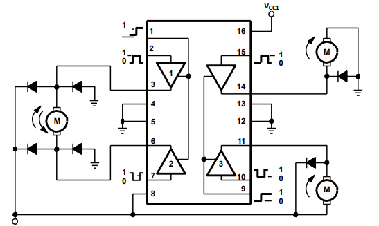
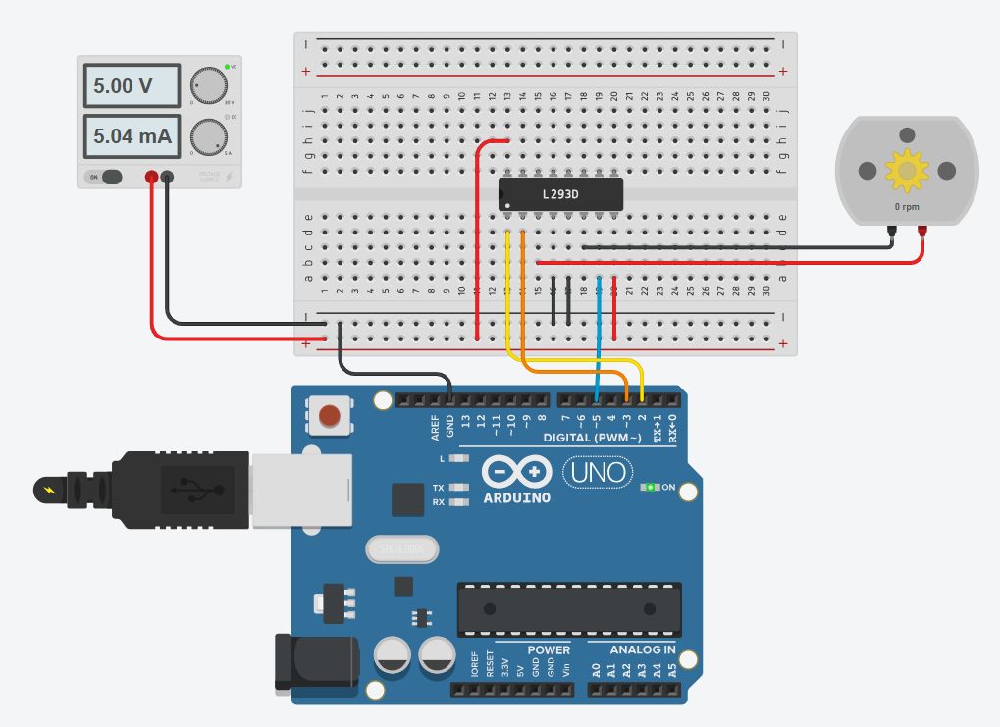
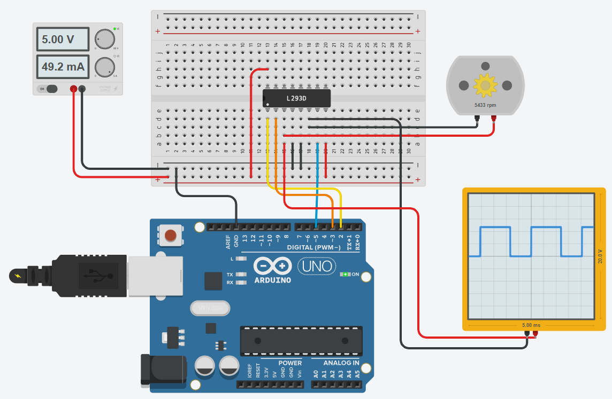

# Example: L293D + DC Motor

The L293 and L293D are quadruple **high-current half-H drivers**. The **L293** is designed to provide 
bidirectional drive currents of up to 1A at voltages from 4.5V to 36V. The **L293D** is designed to provide 
bidirectional drive currents of up to 600mA at voltages from 4.5V to 36V. 
Both devices are designed to drive inductive loads such as relays, solenoids, dc and bipolar stepping motors, 
as well as other high-current/high-voltage loads in positive-supply applications.

**All inputs are TTL compatible**. Each output is a complete totem-pole drive circuit, with a Darlington 
transistor sink and a pseudo-Darlington source. Drivers are enabled in pairs, with drivers 1 and 2 
enabled by `1,2EN` and drivers 3 and 4 enabled by `3,4EN`. When an enable input is high, the associated 
drivers are enabled, and their outputs are active and in phase with their inputs. When the enable input 
is low, those drivers are disabled, and their outputs are off and in the high-impedance state. 



With the proper data inputs, each pair of drivers forms a **full-H (or bridge)** reversible drive suitable for solenoid 
or motor applications.


## Motor Forward and Backward

## Wiring Diagram 

Connect the L293D ENABLE 1,2 (pin 1) to the digital pin 2 on the Arduino, 
L293D Input 1 (pin 2) to Arduino digital pin 3 (PWM), 
and L293D Input 2 (pin 7) to Arduino digital pin 5 (PWM).   



| Pin | Name   | Description                                         |
|-----|--------|-----------------------------------------------------|
| 1   |  1,2EN | Enable driver channels 1 and 2 (active high input)  |
| 2   |    1A  | Driver 1 input, noninverting                        |
| 3   |    1Y  | Driver 1 output                                     |
| 4   |   GND  | Device ground and heat sink pin                     |
| 5   |   GND  | Device ground and heat sink pin                     |
| 6   |    2Y  | Driver 2 output                                     |
| 7   |    2A  | Driver 2 input, noninverting                        |
| 8   |   VCC2 | Power VCC for drivers 4.5 V to 36 V                 |
| 9   |  3,4EN | Enable driver channels 3 and 4 (active high input)  |
| 10  |    3A  | Driver 3 input, noninverting                        |
| 11  |    3Y  | Driver 3 output                                     |
| 12  |   GND  | Device ground and heat sink pin                     |
| 13  |   GND  | Device ground and heat sink pin                     |
| 14  |   4Y   | Driver 4 output                                     |
| 15  |   4A   | Driver 4 input, noninverting                        |
| 16  |   VCC1 | 5-V supply for internal logic translation           |

Note that the **DC motor needs its own power supply** (more current and 
sometimes higher voltage).
In this case, the two **GND potentials must be connected** to each other!!


## Source Code

No library is required for this example, since all signals can be output 
directly via the Arduino pins.

```C
const int ENABLE = 2;
const int DIR_A = 3;	
const int DIR_B = 5;

void setup() 
{
    pinMode(ENABLE,OUTPUT);
    pinMode(DIR_A,OUTPUT);
    pinMode(DIR_B,OUTPUT);
}

void loop() 
{
    digitalWrite(ENABLE,HIGH); 
  
  	// forward
    digitalWrite(DIR_A,HIGH);    
    digitalWrite(DIR_B,LOW);
    delay(1000);

  	// stop
    digitalWrite(DIR_A,LOW);    
    digitalWrite(DIR_B,LOW);
    delay(1000);    

  	// backward
    digitalWrite(DIR_A,LOW); 
    digitalWrite(DIR_B,HIGH);
    delay(1000);

  	// stop
    digitalWrite(DIR_A,LOW);    
    digitalWrite(DIR_B,LOW);
    delay(1000);    
}
```
Note that we need a **delay between the commands** to give the DC motor 
some time to move to follow.

_Example (Tinkercad):_[Arduino: L293D + DC Motor](https://www.tinkercad.com/things/cquv6WcyB61) 


## Motor Speed 

Using the Arduino PWM pins we can also control the speed of the motor.

## Wiring Diagram 

We use the same wiring diagram as before but we add an oscilloscope 
to observe the PWM signal.



The value of a PWM output can be between `0` and `255`.
The value `0` means output constant `LOW` and the value `255` means output 
constant `HIGH` (i.e. maximum speed).

## Source Code

In this example also no library is required.

```C
const int ENABLE = 2;
const int DIR_A = 3;	// PWM Pin
const int DIR_B = 5;	// PWM Pin

void setup() 
{
  	Serial.begin(115200);
  
    pinMode(ENABLE,OUTPUT);
    pinMode(DIR_A,OUTPUT);
    pinMode(DIR_B,OUTPUT);
}

void loop() 
{
    digitalWrite(ENABLE,HIGH); 
    digitalWrite(DIR_A,LOW); 
    digitalWrite(DIR_B,LOW);  
  
    for(int speed=50; speed < 250; speed += 25)
    {
  	  Serial.print("Speed: ");
      Serial.println(speed);
      analogWrite(DIR_A,speed);    
      digitalWrite(DIR_B,LOW);
      delay(5000);
    }
}
```

Note that we start with a PWM value of `50` because the motor will 
not rotate below this value.

_Example (Tinkercad):_[Arduino: L293D + DC Motor (Speed)](https://www.tinkercad.com/things/cpho9uGiEDM-arduino-l293d-dc-motor-speed) 


## References
* [YouTube (Paul McWhorter): Arduino Tutorial 37: Understanding How to Control DC Motors in Projects](https://youtu.be/fPLEncYrl4Q)
* [YouTube (DroneBot Workshop): Controlling DC Motors with the L298N H Bridge and Arduino](https://youtu.be/dyjo_ggEtVU)
* [YouTube: Arduino for Beginners 20 Using a Motor Shield](https://youtu.be/cqfkH7pyyfY)


*Egon Teiniker, 2020-2025, GPL v3.0*
