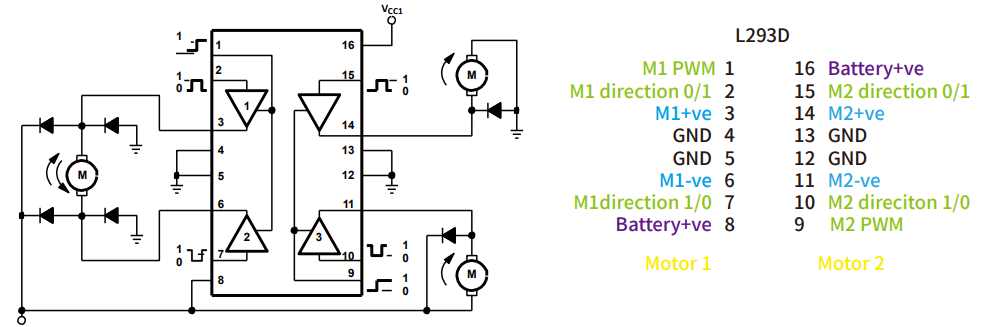
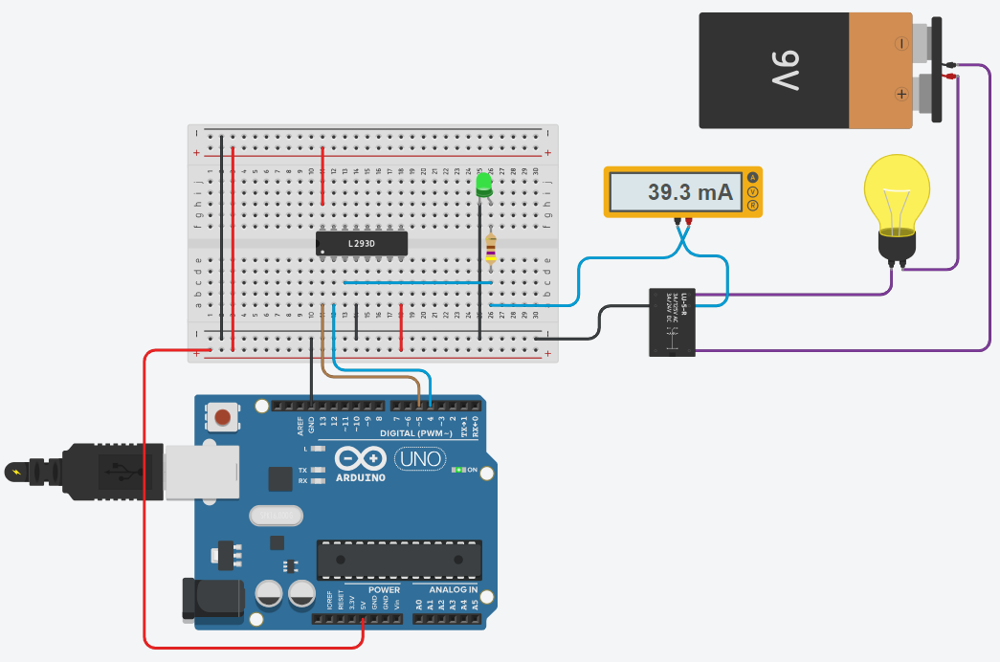
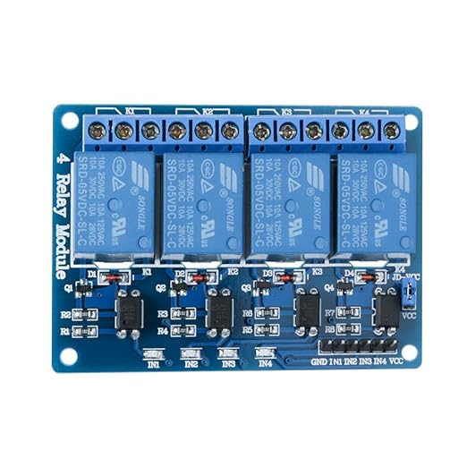

# Relay

An electronic relay is a type of **electrically operated switch**. 
It consists of an electromagnet and a set of contacts. 
The basic function of a relay is to control a high power or high 
voltage circuit with a low power signal. 

How it works:
* **Activation**: When a small electric current flows through the 
    relay coil, it creates a magnetic field. This field attracts 
    the armature, causing it to move and either make or break a 
    connection with the contacts.

* **Switching**: This movement switches the circuit connected to 
    the contacts on or off. The circuit controlled by the relay 
    can be completely separate from the control circuit, 
    allowing a low-power signal to switch a high-power circuit.

* **Deactivation**: When the current flowing through the coil is 
    turned off, the magnetic field collapses. A spring may return 
    the armature to its original position, opening or closing the 
    circuit again, depending on the type of relay.

Types of relays:

* **Electromechanical Relays (EMRs)**: These use a physical moving 
    armature and contacts to switch circuits.

* **Solid-State Relays (SSRs)**: These have no moving parts and use 
    semiconductor devices to perform switching, offering faster 
    response times and longer lifespans.

Advantages:
* **Isolation**: Relays provide electrical isolation between the 
    control circuit and the circuit being controlled.
* **Amplification**: They allow a small current to control a much 
    larger current.
* **Flexibility**: Relays can control multiple circuits and offer 
    both normally open and normally closed configurations.    

Disadvantages:
* **Wear and Tear**: Electromechanical relays have moving parts 
    that can wear out over time.
* **Switching Time**: They are generally slower than solid-state 
    switches.
* **Size**: Relays can be bulkier than solid-state switches for 
    the same application.


## Wiring Diagram 

The coil of a relay requires more current than you should expect 
from an Arduino pin. We therefore use a driver from the L293D to 
control the coil.



The secondary side of the relay is **galvanically isolated** from the 
control and can also switch alternating current (note the limit 
values of the respective relay).



Please note that in practice you use ready-made relay modules that 
have both optocouplers and protective diodes installed.



These modules are available with one, two, four or eight relays.

## Source Code 

The program is simple and does not require a library. 
We control the `PWM` (Enable) pin of the L293D to activate the drivers.
With the `REL_A` pin we switch the relay on and off.

```C++
#define ENABLE 5
#define REL_A 4

void setup() 
{
  pinMode(ENABLE,OUTPUT);
  pinMode(REL_A,OUTPUT);
}

void loop() 
{
    digitalWrite(ENABLE,HIGH); 
    
    digitalWrite(REL_A,HIGH); 
    delay(1000);
    digitalWrite(REL_A,LOW);  
    delay(1000);
}
```

With this circuit we could control up to four relays.

_Example:_ Tinkercad - [Relay](https://www.tinkercad.com/things/1anPgkiYxsJ-arduino-relay-l293d)

## References

* [DroneBot Workshop: Control AC Devices with Arduino](https://dronebotworkshop.com/ac-arduino/)


