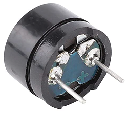
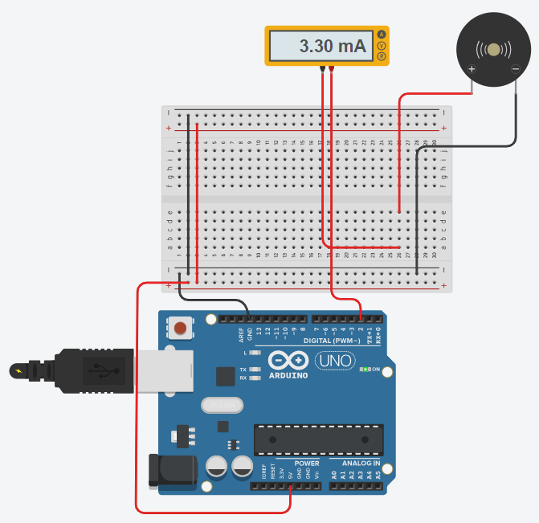

# Buzzers

Piezoelectric buzzers produce a loud noise. When connected to the Arduino they can be used 
as an alarm or notification when a motion sensor is triggered, or when a sensor reaches a 
certain value. They can also be programed to produce musical notes.

There are two types of piezoelectric buzzers that are commonly used in electronics projects – 
active buzzers and passive buzzers. 
**Active buzzers** are called active because they only need a DC voltage to produce sound. 
**Passive buzzers** need an AC voltage to produce sound.

## Active Buzzer 

An active buzzer is a simple electronic sound-generating device commonly used in conjunction 
with microcontroller boards like the Arduino Uno. 


Here's an overview of the concept and functionality of an active buzzer:
* Basic Structure:
    * **Piezoelectric Element**: The core component of an active buzzer is a piezoelectric element. 
        When an electric current is applied to this element, it vibrates, producing sound.
    * Integrated Oscillator: Active buzzers have an integrated electronic oscillator circuit. 
        This circuit creates the electrical pulses needed for the piezoelectric element to vibrate.

* Operation:
    * **Simple Activation**: To use an active buzzer with an Arduino Uno, we only need to provide 
    a DC voltage (usually 5V, which is compatible with the Arduino Uno's output).
    * **No External Frequency Control**: Since the active buzzer has its own built-in oscillator to 
    generate the sound frequency, we don't need to modulate the input signal's frequency. 
    We simply turn it on or off.

* Advantages and Limitations:
    * Easy to use with only basic ON/OFF control, no need for complex frequency control.
    * Lack of flexibility in sound generation, as it can only produce a single tone.

In summary, an active buzzer is a convenient and straightforward component for generating sound 
in Arduino projects, especially when the requirements are basic and involve only simple auditory signals.


## Passive Buzzer

A passive buzzer is a simple piezoelectric device used in electronic projects for sound generation. 
A passive buzzer requires an **external oscillating signal** to produce sound. 



Here's a detailed explanation of its concept:
* Basic Structure:
    * **Piezoelectric Element**: At its core, a passive buzzer has a piezoelectric element that 
    vibrates in response to an electrical signal.
    * **No Internal Oscillator**: Unlike active buzzers, passive buzzers do not have a built-in 
    oscillator circuit. They need an external pulse to make sound.

* Operation:
    * **External Frequency Control**: We must provide a square wave of the desired frequency to 
    make the buzzer produce sound. This is typically done using one of the digital pins of the 
    Arduino Uno.
    * **Variable Tone**: The frequency of the input signal determines the pitch of the sound. 
    By changing this frequency, you can create different tones.

* Advantages and Limitations:
    * Greater flexibility in sound generation compared to active buzzers.
    * Requires more complex control signals for sound generation; cannot generate sound with just a DC voltage.

In summary, a passive buzzer with an Arduino Uno offers more flexibility in sound generation 
than an active buzzer but requires more complex programming to control the frequency and pattern of 
the sound.

## Simulation

_Example:_ [Tinkercad- Arduino: Passive Buzzer](https://www.tinkercad.com/things/b9Wi7EVkkI6-arduino-passive-buzzer)




```C++
const int BUZZER_PIN = 2;
  
void setup()
{
  pinMode(BUZZER_PIN, OUTPUT);
}

void loop()
{
  tone(BUZZER_PIN, 523, 500);	// Alto Do (523Hz)
  delay(1000); 
  
  tone(BUZZER_PIN, 587, 500);	// Re (587Hz)
  delay(1000); 
```

## Library 

The following features are part of the **Arduino Core Library**:

* **void tone(uint8_t _pin, unsigned int frequency, unsigned long duration = 0)**\
    Generates a square wave of the specified frequency (and 50% duty cycle) on a pin. 
    A duration can be specified, otherwise the wave continues until a call to `noTone()`. 
    The pin can be connected to a piezo buzzer or other speaker to play tones.

    Only one tone can be generated at a time. If a tone is already playing on a different pin, 
    the call to `tone()` will have no effect. If the tone is playing on the same pin, the 
    call will set its frequency.

    Use of the `tone()` function will interfere with PWM output on pins 3 and 11 (on boards 
    other than the Mega).

    Parameters:
    * **pin**: the Arduino pin on which to generate the tone.
    * **frequency**: the frequency of the tone in Hertz. 
    * **duration**: the duration of the tone in milliseconds (optional). 

    This **function is non-blocking**, which means that even if you provide the duration parameter 
    the sketch execution will continue immediately even if the tone hasn’t finished playing.


* **void noTone(uint8_t _pin)**\
    Stops the generation of a square wave triggered by `tone()`. 
    Has no effect if no tone is being generated.

    Parameters:
    * **pin**: the Arduino pin on which to stop generating the tone.

    If you want to play different pitches on multiple pins, you need to call `noTone()` on one 
    pin before calling `tone()` on the next pin.


## References

* [How to use active and passive buzzers on the arduino](https://www.circuitbasics.com/how-to-use-active-and-passive-buzzers-on-the-arduino/)

* [GitHub: Arduino Songs](https://github.com/robsoncouto/arduino-songs)

*Egon Teiniker, 2020-2024, GPL v3.0* 
