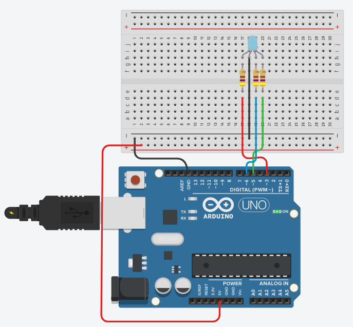

# RBG LED 

An RGB LED is a type of light-emitting diode (LED) that can emit light in a range of colors. 
The acronym "RGB" stands for Red, Green, and Blue, which are the three primary colors of light. 
By varying the intensity of these three colors, an RGB LED can produce a wide spectrum of colors, 
including white.

* Basic Structure:
    * **Three Color Emitters**: An RGB LED consists of three separate LEDs in one package, each 
    capable of emitting red, green, or blue light.
    * **Common Anode or Common Cathode**: RGB LEDs are typically available in two types: common anode 
    and common cathode. In a common anode LED, all three LEDs share a positive connection (anode).
    In a common cathode LED, they share a negative connection (cathode).

* Operation:
    * **Color Mixing**: By adjusting the intensity of each of the three LEDs (red, green, and blue), 
    various colors can be created through a process called additive color mixing. For example, red and 
    green light mixed together produce yellow.
    * **Pulse-Width Modulation (PWM)**: The intensity of each color is often controlled using PWM, 
    where the LED is turned on and off rapidly at a frequency high enough that the human eye perceives 
    it as a steady light. The perceived brightness of the LED changes with the ratio of the on-time to 
    the off-time.

* Advantages and Limitations:
    * Ability to produce a wide range of colors, versatile for various applications.
    * Requires more complex control for color mixing, and the color representation might vary 
    slightly due to differences in individual LED characteristics.


## Simulation 

In TinkerCAD we can wonderfully simulate the control of an RGB LED. We don't need a special library 
for this.
We can set the color components of the LED with `analogWrite()` in the range from `0` to `255`.

_Example:_ [Tinkercad](https://www.tinkercad.com/things/lYwmu9koH0h-arduino-rgb-led-analog) - Arduino: RGB Led 



```C++
const int LED_RED = 3;
const int LED_GREEN = 5;
const int LED_BLUE = 6;

void setup()
{
    pinMode(LED_RED, OUTPUT);
    pinMode(LED_GREEN, OUTPUT);
    pinMode(LED_BLUE, OUTPUT);

    // Color mix
    analogWrite(LED_RED, 50);
    analogWrite(LED_GREEN, 150);
    analogWrite(LED_BLUE, 200);
}
```

## References

* [RGBLed Arduino library](https://github.com/wilmouths/RGBLed)

*Egon Teiniker, 2020-2024, GPL v3.0* 