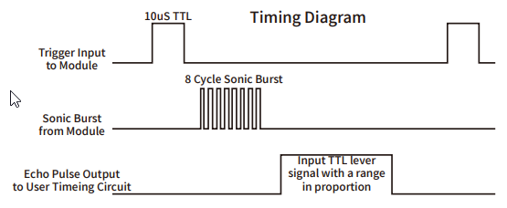

# HC-SR04 Ultrasonic Distance Sensor

The sensor module HC-SR04 provides 2cm-400cm non-contact measurement function, the 
ranging accuracy can reach to 3mm. 

The modules includes ultrasonic transmitters, receiver and control circuit. 



The Timing diagram shows that we only need to supply a short 10us pulse to the trigger 
input to start the ranging, and then the module will send out an 8 cycle burst of ultrasound at 
40 kHz and raise its echo. 

The Echo pulse width is proportional to the distance of the object, or range. 
We can calculate through the time interval between sending trigger signal and receiving 
echo signal: 
```
d = distance [m], t = duration [s], v = speed of sound = 343 [m/s] 

v = s / t = 2*d / t in [m/s];  
=> d = 1/2 * v + t
     = 343/2 * t             in [m]
     = 171.5 * t * 10^(-4)   in [cm]; t in [us]
     = 0.01715 * t           
     = 1/58 * t              
```
we suggest to use over 60ms measurement cycle, in order to prevent trigger signal to the echo signal.


## Wiring Diagram 

The connections are: Voltage, Ground, Trigger and Echo. Trigger and Echo can be connected to any digital pin on our Arduino.


## Source Code

We have to install the [**HC-SR04 library**](https://github.com/teiniker/teiniker-lectures-arduino/tree/main/libraries/HC-SR04) to use the `SR04.h` header file.

The library implements a class named `SR04` which we can use to do the measurement.
We need two digital Arduino pins `ECHO_PIN` and `TRIG_PIN` which are passed into the constructor.

```C
#include <SR04.h>

const int TRIG_PIN = 9;
const int ECHO_PIN = 8; 

SR04 sr04(ECHO_PIN,TRIG_PIN);

void setup() 
{
  Serial.begin(9600);
}

void loop() 
{
   long distances = sr04.Distance();
   Serial.print(distances);
   Serial.println(" cm");    
   delay(250); 
}
```

## Simulation

The following simulation doesn't use a library. Instead, the distance is calculated manually.

**Tinkercad**: [Arduino: Sensor HC-SR04](https://www.tinkercad.com/things/2SftYn3fIlA) 


## Library Operations

This library is used for measuring distance with the HC-SR04 that measures distances from 2 to 400cm. 

* **SR04(int echoPin, int triggerPin)**\
    Constructor for Ultrasonic sensor SR04, four connections pins VCC, ECHO, TRIGGER, GND
	* echoPin: digital INPUT-Pin for measuring distance
	* triggerPin: if 10us high a trigger signal is generated from SR04

* **long Distance()**\
    Do a measurment for this sensor. Return distance as long in centimenter.

* **long DistanceAvg(int wait=DEFAULT_DELAY, int count=DEFAULT_PINGS)**\
	Do count measurents, calculate the average and return the distance in centimeter as long. 
	To avoid defilement from ow/high peaks, min/max values are substracted from the average.
	* wait: delay between measurements, default = DEFAULT_DELAY/ms
	* count: number of measurements, default DEFAULT_PINGS

* **void Ping()**\
    Do only a ping. Get result with methode `getDistance()`.

* **long getDistance()**\
    Return latest distance in centimeters. 
    Methode `Ping()` should be called before.

Note that **there are many different libraries for the HC-SR04 sensor**. 
We use the one shipped with the Elegoo set because it has a simple API.
If you pick another library, make sure you use the right operations as defined in the corresponding 
header file.

## References

* [GitHub: Arduino/ESP8266/ESP32 library for HC-SR04 ultrasonic distance sensor](https://github.com/d03n3rfr1tz3/HC-SR04)
* [Arduino: HC-SR04](https://www.arduino.cc/reference/en/libraries/hc-sr04/)

*Egon Teiniker, 2020 - 2022, GPL v3.0* 
