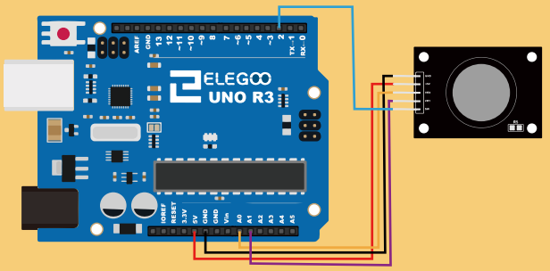

# Analog Joystick

The ELEGOO thumb stick is analog and should provide more accurate readings than simple joysticks that use some forms of buttons, 
or mechanical switches. Additionally, we can press the joystick down (rather hard on mine) to activate a _press to select_
push-button.

## Wiring Diagram 
The module has 5 pins: VCC, Ground, X, Y, Key. 



We use **two analog Arduino inputs (A0 and A1)** to read the data from the **X/Y pins**, 
and a **digital input (D2)** (including pull-up resistor) to read the button pin.

## Source Code

In this program, the analog and the digital pins are read and their values
will be logged to the `Serial` interface.

```C
// Digital pins
const int SWITCH_PIN = 2;
// Analog pins 
const int X_AXIS_PIN = 0; 
const int Y_AXIS_PIN = 1; 

void setup() 
{
  Serial.begin(9600);
  pinMode(SWITCH_PIN, INPUT_PULLUP);
}

void loop() 
{
  // IO Handling
  bool botton = digitalRead(SWITCH_PIN); 
  uint16_t x_axis = analogRead(X_AXIS_PIN);
  uint16_t y_axis = analogRead(Y_AXIS_PIN);

  // Serial logging
  Serial.print("X: "); 
  Serial.print(x_axis);
  
  Serial.print("\tY: "); 
  Serial.print(y_axis);

  Serial.print("\t: ");
  Serial.println(botton ? "OFF" : "ON");
   
  delay(1000);
}
```

*Egon Teiniker, 2020 - 2022, GPL v3.0* 