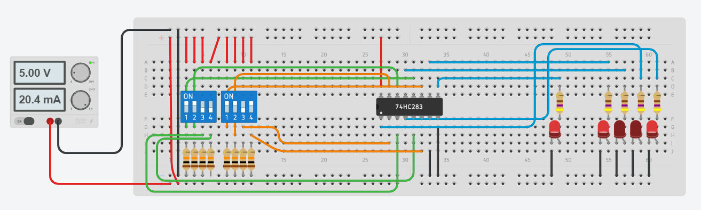

# Simulation: 4-bit Adder

This circuit shows the use of a 4-bit adder 75HC283.

## References
* [Thinkercad](https://www.tinkercad.com/)

* [Electronics Hub: Binary Adder and Subtractor](https://www.electronicshub.org/binary-adder-and-subtractor/)

*Egon Teiniker, 2020-2021, GPL v3.0* 
