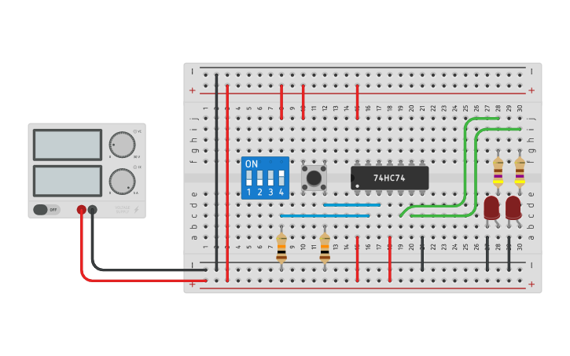

# Simulation: D Flip-Flop

## References
* [Thinkercad](https://www.tinkercad.com/things/3NlWHkeMYlp)

* [Electronics Hub: Designing of D Flip Flop](https://www.electronicshub.org/d-flip-flop/)

*Egon Teiniker, 2020-2021, GPL v3.0* 
