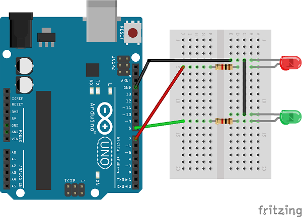

# Timing and Task Scheduling

## Hardware Setup

For the following examples we can use a simple circuit of two LEDs.




## delay() Function

We can use the function `delay()` to force arduino to wait a given time interval.
* **void delay(unsigned long)**\
  Pauses the program for the amount of time (in milliseconds) specified as parameter.

For example, we can use `delay()` to to make an LED blink:
```C
void loop() 
{
  digitalWrite(LED_PIN, HIGH);
  delay(500);                       
  
  digitalWrite(LED_PIN, LOW);
  delay(500);
}
```

The disadvantage of `delay()` is that it is a **blocking function**.
Blocking functions prevent a program from doing anything else until that particular task has completed.
However, it is very often necessary to execute another task during the waiting time.

_Example:_ [Arduino: Blink delay()](https://www.tinkercad.com/things/7TIAkPiA0M0)


## millis() Function
These restrictions can be avoided with the `millis()` function which is a **non-blocking operation**.
Instead of waiting for a certain time, we can always check whether a certain time has already passed.

* **unsigned long millis()**\
  Returns the number of milliseconds passed since the Arduino board began running the current program. 
  This number will overflow (go back to zero), after approximately 50 days.

```C
void loop() 
{
  if(millis() >= timestamp + INTERVAL)
  {
      timestamp = millis();
      digitalWrite(LED_PIN, !digitalRead(LED_PIN));
  }
}
```
Whenever the value of `millis()` is as large as the last timestamp plus the desired interval, 
the status of the LED is changed and the current value of `millis()` is saved as a timestamp.

_Example:_ [Arduino: Blink millis()](https://www.tinkercad.com/things/gsCB4b6UFDm)


## Cyclic Processing
In many programmable logic controllers (PLC) a **cyclic program processing** will be used - the 
program is processed in **fixed cycles**.

A processing cycle usually consists of: 
* **Reading inputs**: Read digital or analog pins
* **Sequentially processing program commands**: Execute the control logic
* **Outputting results**: Write digital or analog pins

```C
void loop() 
{
  // Cycle Time Scheduler 
  while(millis() < timestamp + CYCLE_TIME);  
  timestamp = millis();

  // IO (read and write)
  digitalWrite(LED1_PIN, led1_flag ? HIGH : LOW);
  digitalWrite(LED2_PIN, led2_flag ? HIGH : LOW);
       
  // Control Logic
  led1_flag = !led1_flag; 
  if(counter < 4)
  {
    counter++;
  }
  else
  {
      counter = 0;
      led2_flag = !led2_flag; 
  }
}
```
Note that in order to be able to read and write IO pins at precisely defined intervals, their 
values must be temporarily stored in varibles.


## Task Scheduling

If we want to carry out several tasks (for example blinking LEDs) at the same time, we can 
define different intervals and timestams. We call such a structure a simple **task scheduler**.
```C
void loop() 
{
  // Task 1
  if(millis() >= timestamp_1 + INTERVAL_1)
  {
      timestamp_1 = millis();
      digitalWrite(LED1_PIN, !digitalRead(LED1_PIN));
  }

  // Task 2
  if(millis() >= timestamp_2 + INTERVAL_2)
  {
      timestamp_2 = millis();
      digitalWrite(LED2_PIN, !digitalRead(LED2_PIN));
  }
  //...
}
```
With this construct it should be noted that the tasks must not take longer than the shortest 
interval. Otherwise the timing is no longer right.

If the implementation of the individual tasks get more complex, it makes sense to implement 
independent **task() functions** which are called by the scheduler.

```C
void loop() 
{
  if(millis() >= timestamp_1 + INTERVAL_1)
  {
      timestamp_1 = millis();
      task_1();
  }

  if(millis() >= timestamp_2 + INTERVAL_2)
  {
      timestamp_2 = millis();
      task_2();
  }

  //...
}

void task_1(void) // INTERVAL_1
{
   digitalWrite(LED1_PIN, !digitalRead(LED1_PIN));
}

void task_2(void) // INTERVAL_2
{
   digitalWrite(LED2_PIN, !digitalRead(LED2_PIN));
}
```

_Example:_ [Arduino: Blink Scheduler](https://www.tinkercad.com/things/hBWwhvLwV6O)


## References 
* [Blink Without Delay](https://www.arduino.cc/en/Tutorial/BuiltInExamples/BlinkWithoutDelay)
* [Using millis() for timing](https://learn.adafruit.com/multi-tasking-the-arduino-part-1/using-millis-for-timing)
* [Arduino Tutorial: Using millis() Instead of delay()](https://www.norwegiancreations.com/2017/09/arduino-tutorial-using-millis-instead-of-delay/)
* [Scan time of the PLC program](https://www.plcacademy.com/scan-time-of-the-plc-program/) 
* [YouTube: Arduino Tutorial - Multitasking](https://youtu.be/YP9xQWqFOKg)

*Egon Teiniker, 2020 - 2022, GPL v3.0* 
